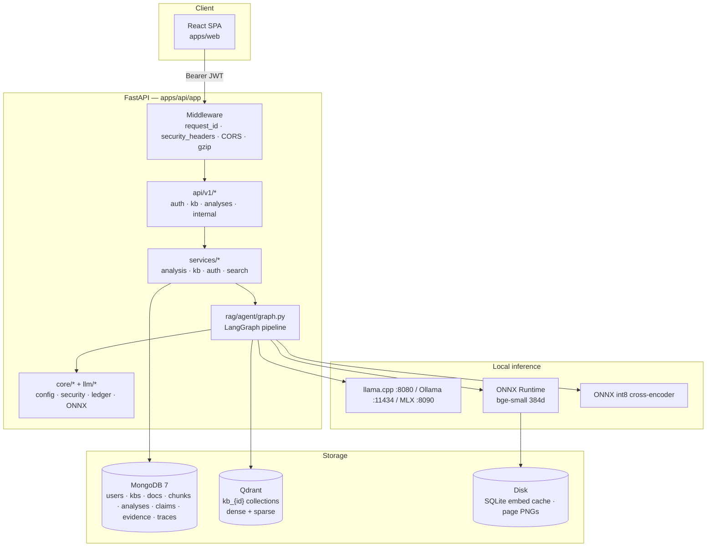
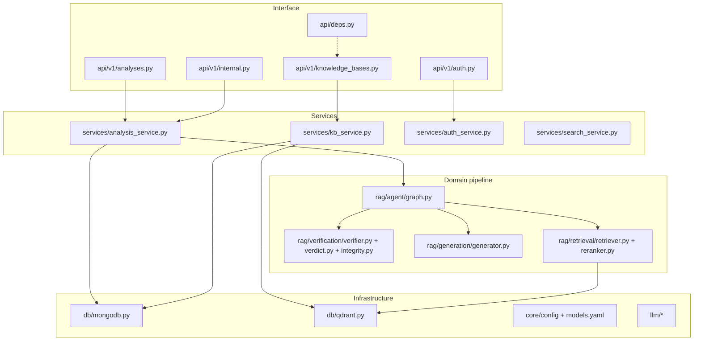
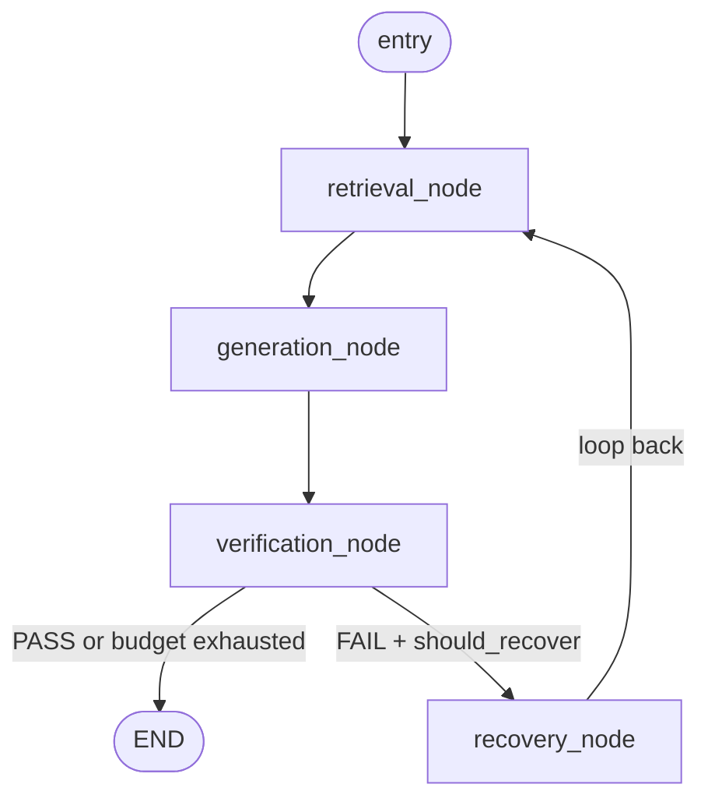
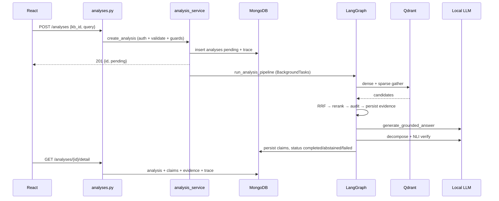

# TrustRAG — Project Deep Dive (Mentor-Ready)

> Labels: **VERIFIED** = read directly from code · **INFERRED** = strongly implied by code/comments · **UNKNOWN** = cannot confirm from repo.
> Verified against HEAD `81e4890` (Oct 2026); full re-verification pass with 4 parallel repo probes (routes/auth/config, RAG/LLM, DB/frontend/compose, weaknesses/security) + skills `code-review-and-quality`, `codebase-design`, `api-and-interface-design`, `security-and-hardening`.
> No source code modified — only this doc.
> Path convention: all backend paths relative to `apps/api/app/`. Correct layout is `rag/agent|retrieval|ingestion|generation|verification`, `llm/`, `core/config|security|system|observability`, `services/`, `db/`, `api/v1/`.

---

## 1. Project Overview

### 1.1 Problem statement (beginner)

A normal LLM chatbot has two problems when you ask *"What is the refund policy in section 4 of our HR doc?"*:

1. It never saw your private PDF — knowledge cutoff + no access.
2. Even if it answers fluently, **fluent text looks identical whether true or invented**. That invention is called **hallucination**.

Standard RAG fixes (1): fetch relevant chunks, paste into prompt, answer *only* from them. It does **not** fix (2) — the model may ignore/misread/blend retrieved text with training priors, and vanilla RAG gives you no signal. **VERIFIED** — this is TrustRAG's thesis: `README.md:49-65`, `docs/` architecture specs.

### 1.2 Solution (intermediate → advanced)

8-stage pipeline **VERIFIED** (`rag/agent/graph.py` — `build_agent_graph`, `execute_agentic_rag_flow`; `README.md:51-63`):

```
Query → Route → Retrieve (hybrid) → Generate (grounded) → Decompose
      → Verify (NLI) → Audit (SHA-256) → Recover or Answer / Abstain
```

| Stage | File (actual) | What |
|---|---|---|
| Route | `rag/agent/router.py: route_query` | Deterministic regex classifier, no LLM call |
| Retrieve | `rag/retrieval/retriever.py: retrieve_hybrid_chunks` | Dense Qdrant + sparse BM25 + RRF fusion |
| Rerank | `rag/retrieval/reranker.py: rerank_candidate_chunks` | ONNX cross-encoder rescores top-20 → top-8 |
| Generate | `rag/generation/generator.py: generate_grounded_answer` | Answers only from chunks, `[Segment N]` markers |
| Decompose | `rag/verification/verifier.py: decompose_answer_to_claims` | Answer → atomic checkable claims |
| Verify | `rag/verification/verifier.py: execute_claim_verification` | Each claim `SUPPORTED`/`CONTRADICTED`/`NEUTRAL` (NLI) |
| Audit | `rag/verification/integrity.py: audit_evidence_integrity` | SHA-256 recompute vs Mongo reference |
| Recover/Abstain | `rag/agent/graph.py: recovery_node, should_recover` + `services/analysis_service.py: _presentable_answer` | Diagnose-then-fix loop (≤2 rounds) or withhold answer |

The single most important design decision **VERIFIED** (`services/analysis_service.py: _presentable_answer`): only `TRUSTED` verdict may display model prose; otherwise a fixed abstention string is returned. The reliability badge can never contradict the prose. Say this to your mentor when asked *"how do you know it works?"*.

### 1.3 Features

| Area | Highlights (**VERIFIED** from README + code) |
|---|---|
| Verification | Per-claim NLI, coverage/contradiction verdict, abstention |
| Retrieval | Dense + sparse + RRF; deterministic router; 4 chunking strategies |
| Ingestion | PDF/DOCX/CSV/JSON/HTML/TXT/MD + RapidOCR fallback (`rag/ingestion/`) |
| Reliability | LangGraph self-heal, token/latency budgets, conflict detection |
| Auth/security | JWT HS256 + JTI denylist, bcrypt, lockout, SSRF guards |
| Integrations | MCP JSON-RPC server (`mcp/server.py`), SSE streaming |
| UI | Dashboard, Playground, KBs, evidence, claims, conflicts, trace viewer |
| Efficiency | ONNX embeddings/reranker (torch-free); KV q8_0, flash-attn, prompt caching |

### 1.4 Tech stack (**VERIFIED** `apps/api/pyproject.toml`, `apps/web/package.json`, `apps/api/config/models.yaml`)

| Layer | Technology |
|---|---|
| Backend | FastAPI 0.115, Python 3.11–3.12, Pydantic v2, LangGraph/LangChain |
| Frontend | React 18, Vite 6, Tailwind 3, TanStack Query 5, React Router 7 |
| LLM | llama.cpp (default) / Ollama / MLX / Gemini — OpenAI-compatible clients in `llm/local_llm.py` |
| Embeddings | `BAAI/bge-small-en-v1.5`, 384-d, **ONNX Runtime only** (`llm/onnx_embeddings.py: ONNXBGEEmbeddings`) |
| Reranker | `cross-encoder/ms-marco-MiniLM-L-6-v2`, ONNX int8 (`llm/onnx_reranker.py`) |
| Vector DB | Qdrant (embedded `local` or server) — `db/qdrant.py` |
| Document DB | MongoDB 7 via `motor` async — `db/mongodb.py` |
| OCR | RapidOCR-ONNX (`rag/ingestion/ocr.py`) |
| Observability | structlog JSON + hand-rolled Prometheus text (`core/observability/`) |

Why ONNX not PyTorch **VERIFIED** (`models.yaml:73-86`, `main.py:167-185`): runtime image is deliberately torch-free to fit 8 GB hosts (~500–1000 MB saved). Weights in `apps/api/.model_cache/*.onnx`, fetched once by `scripts/bootstrap.py`, never committed.

### 1.5 Project structure (actual, **VERIFIED** by directory listing)

```
TrustRAG/
├── apps/api/app/
│   ├── main.py                 # create_app(), lifespan, middleware, error mapping
│   ├── api/router.py           # mounts /api/v1
│   ├── api/deps.py             # get_current_user, require_service_permission
│   ├── api/v1/                 # auth, knowledge_bases, analyses, documents,
│   │                           # claims, evidence, conflicts, models, health, internal
│   │   └── schemas/            # auth.py, kb.py, analysis.py (Pydantic contracts)
│   ├── core/config/            # settings.py (.env), model_config.py (models.yaml)
│   ├── core/security/          # security.py (JWT/bcrypt), exceptions.py (domain errors)
│   ├── core/system/            # hardware.py, concurrency.py, memory.py
│   ├── core/observability/     # logging.py, metrics.py, tracing.py
│   ├── llm/                    # model_registry.py, local_llm.py, onnx_embeddings.py,
│   │                           # onnx_reranker.py, onnx_runtime.py, llm_ledger.py, llm_utils.py
│   ├── db/                     # mongodb.py, qdrant.py  ← ONLY modules touching DBs
│   ├── rag/agent/              # graph.py (LangGraph), router.py
│   ├── rag/retrieval/          # retriever.py, reranker.py
│   ├── rag/ingestion/          # parser.py, chunker.py, chunking_strategies.py,
│   │                           # pipeline.py, preprocessor.py, sparse_vector.py, ocr.py, page_images.py
│   ├── rag/generation/         # generator.py
│   ├── rag/verification/       # verifier.py, verdict.py, integrity.py
│   ├── services/               # analysis_service.py, kb_service.py, auth_service.py, search_service.py
│   └── mcp/                    # server.py (stdio), client.py (in-process dispatcher)
│   ├── config/models.yaml      # single source of truth, config_version 1.26
├── apps/web/src/               # pages, components/workbench, services/api.js, lib/api.js, store/authStore.js
├── config/ports.yaml           # canonical ports (CI drift gate via scripts/apply_ports.py)
└── docs/                       # specs, architecture/, ADRs, evaluation/, deployment/, security/
```

Seam rule **VERIFIED** (`db/mongodb.py` docstring): *"Single source of all database access. No other module should import pymongo or motor directly."* Same for `db/qdrant.py`.

---

## 2. Architecture

### 2.1 System architecture



### 2.2 Backend layered architecture



Layering rule **VERIFIED**: routes validate + delegate; services own business logic **and authorization**; domain modules never touch HTTP.

### 2.3 RAG pipeline (LangGraph state machine)



`AgentState` TypedDict **VERIFIED** (`rag/agent/graph.py`): ~23 fields. Load-bearing: `chunks` + `evidence_ids` (positionally aligned), `attempts` (vs `max_recovery_attempts=2`), `verdict_status` (PASS/FAIL), `diagnosis_type` (`RETRIEVAL_FAILURE`/`LOW_COVERAGE`/`EVIDENCE_CONFLICT`/`VERIFICATION_TIMEOUT`…), `analysis_deadline_monotonic` (whole-run ceiling, separate from recovery budgets).

Recovery mapping **VERIFIED** (`graph.py: _select_recovery_strategy`): retrieval failures → `query_rewrite`; low coverage/conflict → `re_retrieve`; verification/generation errors → `regenerate`; undiagnosed → round-robin over `recovery.strategy_priority`. Re-retrieve downgrades to regenerate when evidence already sufficient (cost-aware, not blind retry).

### 2.4 End-to-end request flow



---

## 3. Backend Deep Dive

Format per component: **WHAT → WHY → HOW → WHERE → INPUT → OUTPUT → DEPENDENCIES**.

### 3.1 Framework & app factory — `main.py: create_app, lifespan`

- WHAT: FastAPI factory + async lifespan. WHY: factory lets tests build isolated app; lifespan sequences startup/shutdown.
- HOW (startup **VERIFIED** `main.py:70-247`): `configure_logging` → `get_settings` (helpful first-run error if `.env` missing) → `TOKENIZERS_PARALLELISM=false` + `OMP_NUM_THREADS` cap → `HF_HUB_OFFLINE=1` **only if weights cached** → log effective config → fail-loud ONNX check → `connect_db` + `create_indexes` → `load_discovery_snapshot` + `init_tracing` → non-blocking warmup (discovery → hardware probe → embedding encode) so port binds instantly.
- Middleware **VERIFIED** `main.py:425-491`: CORS (explicit origins; wildcard `vercel/netlify/pages` regex only non-prod), GZip ≥1 KB, `request_id_middleware` (validates client `X-Request-ID` vs `^[A-Za-z0-9\-]{1,64}$`), tracing, security headers (`nosniff`, `DENY`, Referrer-Policy, Permissions-Policy, HSTS prod-only). No CSP header (**VERIFIED** gap — matters with localStorage JWT).
- Error envelope **VERIFIED** `_register_exception_handlers` + `_error_response`: always `{"error":{"code","message"}}`. `AuthenticationError→401`, `AuthorizationError→403`, `NotFound/AnalysisNotFound→404`, `Conflict→409`, `InputValidation/Ingestion/UnsupportedFormat→422`, `FileTooLarge→413`, `LLMUnavailable/Configuration→503` (actionable message, no secrets), `Database/VectorStore→503 generic`, catch-all `→500 "An unexpected error occurred."` Full trace logged server-side; `X-Request-ID` re-attached from structlog contextvars.

### 3.2 API catalogue (**VERIFIED** `api/v1/*.py`)

| Group | Endpoints |
|---|---|
| Auth (`auth.py`) | `POST /auth/register→201 profile (NOT a token)` · `POST /auth/login→TokenResponse` · `GET /auth/me` · `POST /auth/logout→204 denylist` |
| KBs (`knowledge_bases.py`, 8 routes) | `POST/GET /knowledge-bases` · `GET/DELETE /knowledge-bases/{id}` (vectors dropped **before** Mongo — fail-closed order) · `POST /{id}/snapshots` · `POST /{id}/rollback/{snapshot_id}` · `GET /{id}/documents` · `POST /{id}/documents` (multipart, 20 MB) |
| Documents (`documents.py`) | `GET /documents/{id}` · `DELETE /documents/{id}` · `GET /documents/{doc_id}/pages/{page}/image` (persisted OCR page PNG) |
| Analyses (`analyses.py`, 10 routes) | `POST /analyses→201 pending` · `GET /analyses` (limit 1–200) · `GET /{id}` · `GET /{id}/claims` (latest attempt only) · `GET /{id}/evidence|trace|detail|export` · `POST /{id}/stream-ticket` (60 s single-use Mongo ticket) · `GET /{id}/stream?ticket=` (SSE) |
| Auth (`auth.py`) | `POST /auth/register→201 profile (NOT a token)` · `POST /auth/login→TokenResponse` · `GET /auth/me` · `POST /auth/logout→204 denylist` |
| Ops (`models.py`, `health.py`) | `GET /models/providers|hardware`, `POST /models/memory/trim`, `GET /health` (public), `GET /health/detailed` (auth), `GET /metrics` (public, `include_in_schema=False`) |
| Internal (`internal.py`, service-token, 6 routes) | `POST /internal/tokens (admin:token:create)` · `POST /internal/ingest/document (ingest:write)` · `POST /internal/search (search:read)` · `POST /internal/verify/claims (verify:execute)` · `GET /internal/health` (public) · `GET /internal/status (admin:status:read)` — no `ingest/url` route |

> Correction (re-verified Oct 2026): there is **no** `POST /{id}/documents/from-url` and **no** `POST /internal/ingest/url`. URL ingestion lives in `services/search_service.py: fetch_document_from_url` (SSRF-guarded fetch used by web grounding), not as a KB/document route. Older drafts of this doc listed both — removed.

Schemas **VERIFIED** (`api/v1/schemas/`): `UserRegister` (12+ chars, upper/lower/digit/special, ≤72 B bcrypt cap), `KBCreate{name[1,100],description[500]}`, `DocResponse{ingestion_status: pending/processing/completed/failed}`, `AnalysisCreate{kb_id, query[1,2000], enable_web_search=false, llm_provider, llm_model}` + `enforce_server_model_policy` allowlist validator (see §3.3), `AnalysisResponse{status: pending/processing/completed/failed/abstained, reliability{TRUSTED/UNCERTAIN/ABSTAINED/FAILED/PENDING}}`.

### 3.3 Request lifecycle — `POST /analyses` traced

1. **Auth** `api/deps.py: get_current_user`: `Bearer → decode_access_token → JTI revocation → ObjectId(sub) → users lookup → is_active?` Any fail → 401.
2. **Validation** `schemas/analysis.py: enforce_server_model_policy` (~100 lines): rejects unknown providers; builds per-provider allowlist (local = *actually discovered* models, cloud = `models.yaml`); validates **effective** model not just request field (old bypass bug documented in docstring); same for verification model. WHY: prevents arbitrary HF downloads / unbudgeted cloud calls at the boundary.
3. **Service guards** `services/analysis_service.py: create_analysis`: `get_kb` ownership → **embedding-space pin check** (KB pinned at first ingest; mismatch → 422, prevents garbage retrieval) → token budget pre-check → resolve effective provider/model → **local LLM preflight probe** (~3 s; without it a stopped Ollama burns ~9×120 s timeouts) → insert `analyses` pending + `analysis.started` trace → queue `run_analysis_pipeline` in `BackgroundTasks` → return 201. Client polls `GET /{id}` or streams SSE.
4. **Config precedence VERIFIED**: `apps/api/config/models.yaml` → `config/ports.yaml` → `.env` wins. `config_version` stamped per analysis for traceability. Ports propagated by `scripts/apply_ports.py`, CI drift gate.

### 3.4 Auth & security — `core/security/security.py`, `services/auth_service.py`, `services/search_service.py`

- JWT HS256, `iss`/`aud`, 60 min, unique `jti`; **type-confusion guard** rejects service tokens where user token required (shared secret/algorithm); `jti_key` falls back `sub:iat` for legacy. Revocation = `revoked_tokens` TTL on `expires_at`. Login lockout = `failed_logins` (5/15 min **VERIFIED** `core/config/settings.py`), TTL janitor.
- Passwords: bcrypt cost 12, explicit 72-B ceiling; **timing defence**: user-not-found runs real cost-12 bcrypt on dummy hash so timing matches wrong-password branch.
- SSRF (strongest security code): exact-origin allowlist (request may narrow, never widen), non-canonical numeric-IP rejection, every DNS answer must be globally routable, **TCP IP pinning** via custom `httpcore` backend (closes DNS-rebinding TOCTOU), per-hop redirect revalidation.
- Prompt-injection: 3 layers — XML fencing + `neutralize_prompt_fences()` + NLI/grounding gate (fencing explicitly *not* sufficient).

### 3.5 DB interaction, concurrency, budgets

- Mongo via `db/mongodb.py` singleton (`_client/_database`), 12-attempt exp backoff (Atlas M0 resume), URI validated before retry, `maxPoolSize=50/minPoolSize=2/tz_aware`. Qdrant via `db/qdrant.py` async client, embedded-vs-server mode detection (Windows paths recognised).
- Concurrency **VERIFIED** `core/system/concurrency.py`: loop-keyed `WeakKeyDictionary` LLM semaphore (2/4/8 by RAM); ingestion serialised per-process at 1 (`rag/ingestion/pipeline.py`) to avoid starving local embedder. Cost ledger **VERIFIED** `llm/llm_ledger.py`: `ContextVar`-scoped per-analysis call count, cloud cap 24, plus 120 s whole-run wall clock (`cost_controls.max_analysis_seconds`) and recovery token/latency budgets.

---

## 4. RAG Deep Dive (zero → advanced)

### 4.1 Why RAG + why verify

Weights are frozen at train time → no private docs + no citations. RAG inserts retrieved text at query time, solving both *iff retrieval works*. When it fails the model fills gaps from priors = hallucination. TrustRAG = RAG + per-claim entailment check + abstention.

### 4.2 Ingestion: document → vectors — `rag/ingestion/`

**Parser** `parser.py: parse_document` → `[{page,text,…}]`. Formats PDF/DOCX/CSV/JSON/HTML/TXT/MD **VERIFIED**. Controls: `validate_magic_bytes`, `check_decompression_bomb`, `scan_for_malware`, `defusedxml`, charset sampling, `extract_dates` (feeds temporal filter).

**Chunker** `chunker.py` + `chunking_strategies.py`: `chunk_size 512` chars (~128 tokens), `overlap 64`, word-snapped; strategies `sliding_window` (default) / `semantic` (heading-aware, keeps true page offsets for citations) / `progressive` / `layout_aware` **VERIFIED** `models.yaml:193-212`. WHY chunk: 512-token embed limit + whole-doc vector loses locality; overlap covers boundary facts.

**Embeddings** `llm/onnx_embeddings.py: ONNXBGEEmbeddings` (LangChain `Embeddings` subclass): BGE-small 384-d L2-normalised, ONNX Runtime. **Query/document asymmetry VERIFIED**: queries prepend `Represent this sentence for searching relevant passages: …`, documents don't. Two-tier cache (LRU + SQLite) with **mode-namespaced keys** (query vs doc vectors of same string differ).

**Sparse** `rag/ingestion/sparse_vector.py: generate_sparse_vector`: client TF `freq*(k1+1)/(freq+k1)`, `k1=1.2 b=0.75 avg_len=128` **VERIFIED**; zone boost (TITLE/HEADER up to 2×); `xxhash32` → 1 M vocab; IDF applied **server-side** by Qdrant (`Modifier.IDF` in `db/qdrant.py`); query side skips length-norm (rank-neutral).

**Pipeline** `rag/ingestion/pipeline.py: _index_parsed_chunks`: status→processing → persist page PNGs → **embedding-pin check before writes** → write Mongo chunks with `text_hash=sha256(text)` (audit reference) → `init_kb_collection` → contextual prefix `[filename | ZONE] text` for **dense only** (sparse uses raw — filename would dominate BM25) → batch embed → Qdrant upsert ×100 → completed. Deterministic point IDs `UUID(sha256(doc_id_chunk_idx)[:16])` = idempotent re-ingest.

### 4.3 Vector DB — `db/qdrant.py`

One collection per KB `kb_{id}` = physical tenant isolation; delete = collection drop. Config **VERIFIED**: dense COSINE 384, sparse `sparse-text` + IDF modifier, `on_disk` vectors+payload, INT8 quant `quantile 0.99` (4× RAM). `QDRANT_URL=local` → embedded; `http(s)` → server.

Why Qdrant over Pinecone/Milvus **INFERRED**: embedded zero-infra local-first + native hybrid sparse + per-collection isolation + quant without extra parts.

### 4.4 Retrieval — `rag/retrieval/retriever.py: retrieve_hybrid_chunks`

1. Dense: embed query (`asyncio.to_thread`), dim check, `query_points` cosine. 2. Sparse: BM25 hashed vector, `using="sparse-text"`. Concurrent via `asyncio.gather` — docstring *"Both branches required. Failure of either fails entire retrieval"* (deliberate: partial set worse than honest failure). 3. **RRF** `1/(rank+60)+…` — merges *rankings* not scores (cosine vs BM25 incomparable; no tuning). 4. **Temporal filter**: join `documents` metadata, drop outside `effective_from/until`; orphans fail closed (deleted doc's vectors never served). 5. Slice `fusion_top_k=20`.

> Shipped default is **dense-only**: `sparse_top_k: 0` makes `sparse_search` return `[]` immediately **VERIFIED** (`models.yaml:166`, `retriever.py`). README advertises hybrid — documentation defect, sparse path fully implemented (set >0 to enable).

### 4.5 Rerank — `rag/retrieval/reranker.py`

Cross-encoder scores `(query,chunk)` **jointly** (bi-encoder can't model interaction; cross-encoder too slow for full corpus → retrieve-then-rerank 20→8). ONNX int8 MiniLM, `asyncio.to_thread` off event loop, adaptive top-k/early-exit.
**Fails OPEN to RRF order** (correction — older drafts said "fails closed"): `reranker.py:88-90` returns `chunks[:max_context]` when `model is None`, and `:164-166` catches all exceptions with `falling back to RRF rankings`. Per the api/code-review lens this is the right availability trade-off (one missing weight file shouldn't 500 every query), but the `models.yaml:116` comment phrase "fails closed to RRF order" is sloppy wording — RRF fallback *is* the open path. Call it fail-open in viva.

### 4.6 Audit — `rag/verification/integrity.py`

Cap 100 (OOM guard) → web chunks `EXTERNAL_UNAUDITED` (never VERIFIED) → one `$or` fetch of `text_hash` → `sha256(retrieved)==stored` ? `VERIFIED` : `CORRUPTED`; missing ref → `CORRUPTED`. Mismatches excluded from generation. Limitation: detects **post-ingest** modification only; pre-ingest tampering defeats it (hash from same source).

### 4.7 Prompt — `rag/generation/generator.py: generate_grounded_answer`

Empty chunks → `"ABSTAIN"` with **zero LLM calls** → tiktoken dynamic `num_ctx` → messages `[System GROUNDING_PROMPT, Human <context>fenced</context> <query>fenced</query>]` (query fenced too — attacker-influenced) → provider kwargs (local gets `num_ctx/n_batch/keep_alive`; Gemini never) → cleanup (`extract_final_answer`, think-strip, `normalize_llm_content`). Citations `[Segment N]` + `evidence_ids` → Mongo `evidence`.

### 4.8 Decompose + NLI — `rag/verification/verifier.py`

NLI = entailment classification (support/contradict/silent), not circular self-assessment. Fused path: one structured call decompose+verify, fallback two-step (`decompose→batch→per-claim`; batch exists to avoid 429). **Small-model hardening VERIFIED**: 40-entry alias map (`VERIFIED/S/ENTAILMENT`→`SUPPORTED`… — strict `Literal` turned near-misses into `NEUTRAL` → 0/8 on good answers), meta-claim filter, degenerate-loop detector, `is_refusal_answer` zero-LLM gate. **Targeted retrieval**: `NEUTRAL` claims re-searched by *claim text* (≤2–3); `CONTRADICTED` deliberately excluded (*"re-searching for support would cherry-pick"*).

### 4.9 Verdict — `rag/verification/verdict.py: compute_verdict`

```
coverage = supported/total; contradiction = contradicted/total
score = coverage*(1-contradiction)
TRUSTED iff coverage≥0.80 and contradiction≤0.20
else UNCERTAIN (score≥0.50) / FAILED; ABSTAINED if answer==ABSTAIN
```

Thresholds **VERIFIED** `models.yaml:227-229`; file warns *"engineering defaults — NOT calibrated probabilities"*. Never quote 0.87 as 87% correct.

---

## 5. Database

### 5.1 Two stores (**VERIFIED**)

| | MongoDB (`motor`) | Qdrant |
|---|---|---|
| Holds | users, KBs, docs, canonical chunks+hash, analyses, claims, evidence, recovery_runs, trace_events, feedback, revoked_tokens, stream_tickets, failed_logins | vectors + payload copy |
| Answers | "all claims for analysis X" (filter/integrity) | "20 chunks most similar to Q" (ANN) |
| Module | `db/mongodb.py` | `db/qdrant.py` |

Chunk text in **both**: Mongo = source of truth for audit; Qdrant = index. That's what makes tamper check meaningful.

### 5.2 Collections & indexes (**VERIFIED** `db/mongodb.py: Collections`)

`users(email unique)`, `knowledge_bases(user_id,created_at)`, `documents(kb_id,content_hash unique — dedupes re-upload)`, `document_chunks(document_id,chunk_index unique)`, `analyses(user_id,created_at; user_id,status)`, `claims(analysis_id,state)`, `evidence(analysis_id)`, `recovery_runs(analysis_id,attempt)`, `trace_events + 30 d TTL`, `revoked_tokens TTL expires_at`, `stream_tickets TTL`, `failed_logins TTL`. Optional fields (`effective_from`, `ocr_confidence`, `page_image_ref`) = schemaless evolution, no migrations.

### 5.3 Connection & queries

`connect_db`: singletons, Atlas-aware timeouts, `tlsCAFile=certifi`, pools 50/2, `tz_aware`; 12-attempt backoff (M0 auto-pause); URI validated pre-retry; `create_indexes` in batches of 5 (M0 throttle), failures logged never silent. Patterns: single aggregation for KB doc-counts (no N+1), batched `find({_id:{$in}})` for filenames, uniform `get_*` ownership check (`str(doc[user_id])!=uid → AuthorizationError`).

---

## 6. Complete Example

Query: `"What is the rate limit for the free tier?"` vs KB with API spec.

| Step | File:function | What happens |
|---|---|---|
| 1 Frontend | `web/src/pages/PlaygroundPage.jsx` → `QueryPanel` → `services/api.js: analysisService.create` → `lib/api.js` (Bearer attach; FormData CT-strip) | Input → POST |
| 2 Route+validate | `api/v1/analyses.py: create_analysis_endpoint` → `deps.get_current_user` → `schemas/analysis.py` (1–2000 chars, provider allowlist, effective-model) | 401/422 on fail |
| 3 Guards | `services/analysis_service.py: create_analysis` | KB ownership → embed-pin 422 → 400-token budget → LLM preflight 503 → insert pending + trace → 201 + BackgroundTasks |
| 4 Router | `rag/agent/router.py: route_query` | No year/comparison → SIMPLE → 1 retrieval |
| 5 Retrieve | `rag/retrieval/retriever.py` | ONNX embed + (sparse `[]` at default) → RRF k=60 → temporal join → top-20 |
| 6 Rerank | `rag/retrieval/reranker.py` | ONNX cross-encoder 20→8 |
| 7 Audit | `rag/verification/integrity.py` | sha256 recompute; CORRUPTED excluded |
| 8 Persist | `rag/agent/graph.py` retrieval_node | Batch-insert `evidence`; `chunks↔evidence_ids` aligned |
| 9 Generate | `rag/generation/generator.py` | Fenced prompt → llama.cpp → `[Segment N]` answer |
| 10 Verify | `rag/verification/verifier.py` | Fused call → e.g. `["Free tier 100 req/min", SUPPORTED,[1]]`, `["resets daily", NEUTRAL,[]]` → targeted re-retrieve NEUTRAL → persist `claims` |
| 11 Verdict+gate | `rag/verification/verdict.py` + `_presentable_answer` | coverage/contra → TRUSTED shows prose else abstention |
| 12 Render | `GET /{id}/detail` (1 auth + 3 parallel) → `ResultsPanel`, `FormattedAnswer` (react-markdown, no `dangerouslySetInnerHTML`), `ClaimInspector`, `EvidenceViewer`, `PipelineTelemetryHUD` | Answer + per-claim badges + trace |

---

## 7. Mentor Preparation

### 7.1 Two-minute pitch

> TrustRAG is RAG built around trust, not just knowledge. Standard RAG retrieves docs and answers, but gives no signal whether the answer is supported. We run route→retrieve→generate→decompose into atomic claims→verify each by NLI→audit hashes→recover or abstain. Only a TRUSTED verdict displays model text; everything else is withheld. It runs fully local — ONNX embeddings, local LLM, embedded Qdrant, MongoDB — no keys, no per-query cost. The core engineering is failure handling: telling "no evidence" apart from "infrastructure down".

### 7.2 Five-minute technical

Add: hybrid dense BGE-384 + BM25 (server IDF) fused by RRF (ranks not scores — cosine vs BM25 incomparable), cross-encoder 20→8; one Qdrant collection per KB (physical isolation); text in both stores (Mongo truth + hash vs Qdrant index = audit possible); embed-pin guard (422 not garbage); fused decompose+verify with two-step fallback; NEUTRAL-only targeted re-retrieve (CONTRADICTED excluded anti-cherry-pick); ContextVar LLM ledger + 120 s wall clock.

### 7.3 Ten-minute deep

Add: 3-layer injection defence (fence + neutralise + NLI/gate; fencing explicitly insufficient); TCP-level SSRF pinning (custom httpcore backend — no rebind window); small-model hardening (alias map, scaffolding strip, loop detector, refusal gate — 0/8→correct); delete order vectors-before-Mongo (fail-closed); next fixes: 1474-line `graph.py` split, internal ingest binding, slowapi/README drift.

### 7.4 30+ likely questions

**Fundamentals**
1. *Plain RAG gap?* Knowledge vs trust; per-claim verdict + withholding. 2. *Why claims not whole-answer score?* Localises failure → targeted recovery + honest UI. 3. *NLI vs "is this true?"* Entailment vs provided text; self-assessment circular.
**RAG**
4. *Embeddings how?* `llm/onnx_embeddings.py` BGE-small 384 L2-norm, torch-free, query-prefix asymmetry, namespaced cache. 5. *Why Qdrant?* Embedded local-first, native hybrid+IDF, per-KB isolation, INT8. 6. *Dense+sparse why?* Semantic vs exact-token (codes/names); fail differently → recall. 7. *RRF vs weighted fusion?* `1/(rank+60)`; ranks comparable, scores aren't; parameter-free. 8. *Reranker why separate?* Joint scoring accurate but slow → 20→8 funnel. 9. *512/64 why?* 512-token cap, locality, overlap covers boundaries; 4 strategies. 10. *Temporal filter?* `effective_from/until` from `extract_dates`; join-drop; orphans fail closed.
**Architecture**
11. *Async + BackgroundTasks why?* I/O-bound; 201 immediate, poll/SSE. 12. *Mongo+Qdrant why?* Document queries vs ANN; dual text enables audit. 13. *LangGraph value?* Cyclic recovery + conditional exit + single `AgentState`; compiled singleton. 14. *No-evidence vs outage?* `RetrievalOutageError` → `RETRIEVAL_OUTAGE`, budget exhausted, explicit message (not "insufficient evidence").
**Security**
15. *Auth?* HS256 iss/aud, 60 m, jti denylist TTL, service/user type guard, bcrypt-12 + 72 B, dummy-hash timing defence, 5/15 m lockout. 16. *localStorage risk?* XSS→theft; mitigations: no JWT in URL (SSE tickets), server revocation, no `dangerouslySetInnerHTML`; honest fix httpOnly + CSP (missing). 17. *Injection?* Fence + neutralise + NLI/gate. 18. *Tamper evidence?* Ingest hash vs query recompute; post-ingest only. 19. *Cross-tenant?* Uniform service `get_*` ownership check.
**Why X vs Y**
20. *ONNX vs torch?* 8 GB RAM, 500–1000 MB + 3–4× rerank; export cost on host. 21. *Qdrant vs Pinecone?* Embedded vs cloud contradicts local-first. 22. *FastAPI vs Flask/Django?* Async I/O + Pydantic boundary enforcement. 23. *Deterministic router vs LLM?* Zero cost/latency, reproducible, un-prompt-hackable; fallback SIMPLE. 24. *Text in Mongo too?* Independent reference or audit vacuous. 25. *Native vector search?* Filter-bug leak vs physical isolation.
**Hard (understanding test)**
26. *`sparse_top_k: 0` vs "hybrid" README?* Config wins — dense-only shipped; docs defect, path implemented. 27. *`gather` without `return_exceptions` bug?* Deliberate — partial set worse than honest fail. 28. *Attacker writes both DBs?* Audit defeated; single-store/accident model — need external signatures for stronger. 29. *0.80/0.20 calibrated?* No — engineering defaults, warn never quote as probability; calibrate on labelled set. 30. *`graph.py` 1474 lines — split?* Extract self-heal re-index, per-node modules, rewrite-sanitise helper; keep assembly. 31. *Why pin KB to one embed model?* Mixed spaces → garbage cosine; 422 forces new KB. 32. *Why CONTRADICTED excluded from re-retrieve?* Anti-cherry-pick. 33. *Why preflight LLM probe?* Avoid 9×120 s cascade when server down.

---

## 8. Weaknesses (code-backed only — re-verified Oct 2026)

> Method: 4 parallel repo probes (backend/routes/auth/config, RAG/LLM, DB/frontend/compose, weaknesses/security) + `code-review-and-quality`, `codebase-design`, `api-and-interface-design`, `security-and-hardening` skills. Items marked **REFUTED/FIXED** were false in the prior draft — do not quote them in viva; quote the correction instead.

| ID | Issue | Evidence | Status |
|---|---|---|---|
| W1 | ~~MCP + tests reference deleted `duckduckgo_search`~~ — FIXED upstream. `mcp/server.py` now exposes only `tavily_search` (+`trustrag_*`/`local_llm_*`); `tests/test_search_mcp.py` asserts `duckduckgo_search` → `Unknown MCP tool`. Live residue: dead compat field `web_search_provider="both"` (default in `schemas/analysis.py:38`, `graph.py:82/1534`, `analysis_service.py:573`) — retrieval always calls `tavily_search` (`graph.py:645`) and never reads the provider. Remove or honour the field. | `mcp/server.py:115/219-223`, `graph.py:82,636-685` | was-CRITICAL → now cleanup |
| W2 | ~~`uv.lock` out of sync (`ddgs`)~~ — REFUTED. 0 hits for `ddgs/duckduckgo-search/slowapi` in `uv.lock`; `pyproject.toml:33-35` lists only `mcp, tavily-python`. Old line refs were stale. | `uv.lock` grep | refuted |
| W3 | Phantom `slowapi`: zero code, docs claim rate-limiting | grep `app/` = 0 hits (only a `main.py:6` comment + unrelated "rate-limited" words); `README:606`, `SECURITY.md:40`, `security-controls.md:42` claim it; only live control = login lockout → `/analyses` DoS unbounded | VERIFIED, high |
| W4 | Docs claim hybrid default; config dense-only | `models.yaml:166 sparse_top_k: 0` vs README/architecture | VERIFIED |
| W5 | Cross-tenant `POST /internal/ingest/document` with unbound service token (`user_id` from body, binding only if `bound_user_id`) | `internal.py:32-38,91-118`; `kb_service.get_kb` checks supplied id = bypass; tracked as M-2 | VERIFIED, high |
| W6 | `POST /internal/tokens` cannot mint bound tokens: takes only `service_name + permissions`, never passes `bound_kb_id/bound_user_id` although `security.py:153-193` supports them — least-privilege scoped tokens are unmintable, so every token is effectively unbound (what makes W5 exploitable) | `internal.py:65-75` | VERIFIED |
| W7 | ~~Silent loss past 1000 analyses~~ — REFUTED as stated. No `[:1000]` answer fallback. Actual: legacy list paths use `.to_list(1000)` pagination caps (`analysis_service.py:873/898/918`) — bounded, not silent-loss. Call it a pagination limit. | `analysis_service.py` grep | refuted |
| W8 | `GET /metrics` public | `health.py:34-42` (counters only, `include_in_schema=False`) | VERIFIED, low |
| W9 | Non-prod CORS wildcard `*.vercel/netlify/pages` + credentials | `main.py:445-462` | VERIFIED |
| W10 | No CSP + localStorage JWT | `main.py:473-483` headers; `store/authStore.js:9-10` | VERIFIED |
| W11 | Self-heal `.to_list(10_000)` partial + reports 100% | `rag/agent/graph.py` |
| W12 | `locals()` for control flow | `graph.py` recovery node |
| W13 | Frontend poll no `AbortSignal` + SSE+poll double load | `PlaygroundPage.jsx` |
| W14 | Dead code (unused `authService.me`, inert button, comment CSS, Tailwind orphans) | `services/auth.js`, `ResultsPanel.jsx`, styles |
| W15 | Oversize modules (`graph` 1474, `verifier` 1271, `config` 1033, `analysis_service` 951) | line counts |
| W16 | NLI = same 1.2B LLM, not dedicated entailment model | `verifier.py`, `models.yaml: verification` |
| W17 | Audit storage-layer only (pre-ingest blind) | `integrity.py` |
| W18 | Embed change invalidates all KBs (safe 422, but full re-upload) | `analysis_service.py`, `pipeline.py` pin checks |
| W19 | Single-node caps (LLM 2/4/8, ingest 1); SSE in-process only | `concurrency.py`, `pipeline.py`, `analysis_service._publish` |
| W20-23 | CI: security job not gating, no coverage gate, E2E no Ollama service (core loop untested), `npm audit` uses `install` not `ci` | `.github/workflows/` |
| W27 **(new)** | `DiagnosisType` enum drift: `verdict.py:62-70` defines 5 values, but `graph.py` sets `VERIFICATION_TIMEOUT/VERIFICATION_ERROR/RETRIEVAL_ERROR/GENERATION_ERROR/RECOVERY_BUDGET_EXHAUSTED/LLM_UNAVAILABLE`. Works only because `AgentState.diagnosis_type: str\|None` — `compute_verdict` can never emit the wider set. | `verdict.py` vs `graph.py:197/337/599/815/888/987/998/1173/1479` | VERIFIED |
| W28 **(new)** | `tier_caps` substring bug: `model_config.py:761` `prov in "gemini"` is substring-in-string, not tuple membership (`prov="gem"` misclassifies). Next line uses the correct tuple form. One-char fix. | `model_config.py:751-766` | VERIFIED, low |
| W29 **(new)** | Rerank "fails closed" comment is wrong: `models.yaml:116` wording vs actual fail-open fallback (`reranker.py:88-90/164-166` return RRF order on missing model/exception). Behaviour is right (degrade, don't 500); wording misleads. | `models.yaml:116`, `reranker.py` | VERIFIED, docs |
| W24-26 | Docker: `web` as root, Qdrant unauth on LAN, no `read_only/cap_drop/limits` | `docker-compose.yml` | VERIFIED |

---

## 8B. Backend From Zero — for B.Tech students (read this first if backend is new)

### B0. What is a backend? (30-second version)

Frontend = what the user sees (React buttons, answer cards). Backend = the kitchen that does the work: checks *who you are*, validates *what you asked*, runs the RAG pipeline, reads/writes databases, returns JSON. **VERIFIED**: React in `apps/web/src` never touches MongoDB/Qdrant/LLM directly — every data call goes through `lib/api.js` → `http://localhost:8000/api/v1/*` → FastAPI.

Restaurant analogy: frontend = waiter + menu, API = order slip format, backend services = cooks, MongoDB/Qdrant = pantry/fridge, LLM = outside caterer you phone for one dish.

### B1. REST + JSON in one table

| Concept | B.Tech meaning | In TrustRAG (**VERIFIED**) |
|---|---|---|
| REST endpoint | A URL + HTTP verb = one action | `POST /api/v1/analyses` = "start analysis"; `GET /api/v1/analyses/{id}/claims` = "give me claims" (`api/v1/analyses.py`) |
| JSON request | The order slip | `{"knowledge_base_id":"…","query":"What is…?"}` validated by `schemas/analysis.py: AnalysisCreate` |
| JSON response | The served plate | `{"id":"…","status":"pending"}` via `AnalysisResponse` |
| Status code | Result category | `201` created, `401` no/bad token, `403` not yours, `422` bad input, `503` DB/LLM down (`main.py` handlers) |

Try it: Swagger at `http://localhost:8000/docs` lists every endpoint live — click, fill JSON, execute.

### B2. FastAPI layers — where does your query go?

```
Browser → main.py (middleware) → api/v1/*.py (route) → api/deps.py (who are you?)
→ schemas/*.py (is the slip valid?) → services/*.py (do the business logic)
→ rag/* + llm/* (pipeline) → db/*.py (persist) → JSON back
```

- **Routes** (`api/v1/`): thin. They parse path/query/body and call a service. Example **VERIFIED** `analyses.py: create_analysis_endpoint` takes `AnalysisCreate`, `current_user = Depends(get_current_user)`, calls `analysis_service.create_analysis(...)`.
- **Dependencies** (`api/deps.py: get_current_user, require_service_permission`): reusable gatekeepers. Every protected route declares `Depends(get_current_user)` — no copy-pasted token code.
- **Schemas** (`api/v1/schemas/`): Pydantic models = contract + validator. `query: str = Field(min_length=1, max_length=2000)` rejects empty/absurd input before any money/time is spent. The 100-line `enforce_server_model_policy` validator builds the allowed-model list per provider (local = actually discovered, cloud = `models.yaml` allowlist) and checks the *effective* model — prevents asking for an arbitrary HF model that would trigger a huge download.
- **Services** (`services/`): the only place with business rules + ownership checks. `analysis_service.create_analysis` does: `get_kb` → ownership (`str(doc[user_id]) != uid → 403`) → embed-pin guard → budget guard → LLM preflight → insert `analyses{status:pending}` → queue background job → return 201.
- **DB seam** (`db/`): only layer importing `motor`/`qdrant-client`. Services call `get_collection("analyses").insert_one(...)`, never raw connections.

**WHAT→WHY→HOW for services:** WHAT = business logic + authz. WHY = routes stay thin so a new endpoint can't forget ownership. HOW = every read funnels through `get_*` that compares `user_id`. WHERE = `services/*.py`. INPUT = validated schema + user_id. OUTPUT = serialised response dict. DEPENDS ON = `db/`, `rag/*`, `llm/*`, `core/config`.

### B3. Auth demystified (JWT in 5 lines)

1. `POST /auth/register` stores `bcrypt(password)` — never plaintext **VERIFIED** `core/security/security.py: hash_password`, cost 12, 72-byte cap.
2. `POST /auth/login` checks `verify_password` → returns `access_token` (HS256 JWT, 60 min, `iss/aud`, unique `jti`).
3. Browser stores token in `localStorage` (`web/src/store/authStore.js`) and sends `Authorization: Bearer <token>` via axios interceptor (`lib/api.js`).
4. `get_current_user` decodes → checks revocation denylist (`revoked_tokens` TTL) → loads user → checks `is_active`.
5. `POST /auth/logout` adds `jti` to denylist so the token dies immediately.

Mentor line: *"Stateless JWT + server-side denylist = no session table lookup per request, but logout still works because revoked JTIs self-delete at expiry via TTL."*

### B4. Async + BackgroundTasks — why 201-then-poll?

The pipeline waits on ONNX, Qdrant, Mongo, LLM — all I/O, not CPU. `async/await` frees the event loop so one 60 s analysis doesn't block health checks. `POST /analyses` returns `201 pending` **immediately** and runs `run_analysis_pipeline` in `BackgroundTasks`; client polls `GET /{id}` or opens SSE `GET /{id}/stream?ticket=`. Ticket = 60 s single-use Mongo doc so the JWT never appears in a URL/EventSource header (EventSource can't set headers).

### B5. Config — the 3-layer rule (exam favourite)

`apps/api/config/models.yaml` (model IDs, thresholds, tuning; `config_version: 1.26` stamped per run) → `config/ports.yaml` (ports; `scripts/apply_ports.py` propagates + CI drift gate) → `.env` (secrets + overrides win). Code must read via `get_model_config()`/`get_settings()`, never hardcode — `models.yaml:10` says so explicitly.

---

## 8C. RAG From Zero — the deepest chapter (read slowly)

### R0. The library analogy (hold this in mind)

- Your PDFs = books dumped in a library basement.
- **Chunking** = tearing each book into numbered index cards (512 chars, 64 overlap) so one card = one idea.
- **Embeddings** = writing each card's *meaning* as coordinates, e.g. `[0.21, -0.87, …]` (384 numbers). Nearby points = similar meaning.
- **Vector DB (Qdrant)** = the shelf system that finds nearest coordinates in milliseconds (ANN/HNSW index).
- **Retrieval** = "give me 20 cards nearest to the question's coordinates".
- **Generation** = handing those 20 cards to the LLM and saying "answer ONLY from these, cite card numbers".
- **Verification** = a second pass: split answer into single-fact sentences (claims), ask "does card X entail claim Y?" (NLI), score, abstain if weak.

### R1. Chunking — why not one vector per PDF?

Embed model caps at 512 tokens; a 50-page PDF would be truncated to the first page. One vector per doc also blurs — the "refund = 30 days" sentence drowns in 50 pages. Cards (512 chars ≈ 128 tokens, overlap 64, word-snapped **VERIFIED** `models.yaml`, `rag/ingestion/chunking_strategies.py`) keep one idea per vector. Overlap rescues boundary facts ("…free tier allows 100" | "requests per minute…" still recoverable). 4 strategies behind `ChunkingStrategy.chunk()`: `sliding_window` default, `semantic` (heading-aware, keeps true page offsets → citations stay honest), `progressive`, `layout_aware`. Switching strategy = re-index KBs (boundaries change → old vectors stale).

### R2. Embeddings — meaning as numbers (with tiny example)

`llm/onnx_embeddings.py: ONNXBGEEmbeddings` wraps `BAAI/bge-small-en-v1.5` on ONNX Runtime (no torch → fits 8 GB). Output: 384 floats, L2-normalised → cosine = dot product.

Toy example (2-D instead of 384):

```
"refund within 30 days"  → [0.90, 0.10]
"return window one month"→ [0.85, 0.15]  (paraphrase → nearby ✓)
"server runs on port 8000"→ [0.05, 0.95] (different topic → far ✓)
query "how long for refund?" → [0.88, 0.12] → nearest = card 1, then 2
```

**Two details mentors love:**
- Query/document asymmetry **VERIFIED**: queries get BGE prefix `Represent this sentence for searching relevant passages: …`, documents don't. Same string → different vector by design; cache keys are mode-namespaced or first-call wins and poisons the other.
- Distance = `COSINE` **VERIFIED** (`db/qdrant.py`) because vectors are normalised. Euclidean on normalised vectors ranks identically but wastes the normalisation; cosine is the honest choice — say that.

### R3. Dense vs sparse vs RRF vs rerank (the full retrieval story)

| Leg | What | Catches | Misses | In repo |
|---|---|---|---|---|
| Dense | BGE cosine nearest-neighbour | Paraphrase ("return window" ≈ "refund period") | Exact codes (`ERR_QUOTA_429`, `Section 4.2.1`) | `retriever.py: dense_search`, top 20 |
| Sparse (BM25) | Exact-token TF with server IDF, zone-boosted headings | Part numbers, names, error strings | Synonyms | `sparse_vector.py` + Qdrant `sparse-text` + `Modifier.IDF` |
| RRF fusion | `score = 1/(rank_dense+60) + 1/(rank_sparse+60)` | Merges *rankings* (comparable) not scores (incomparable scales) | — | `retriever.py: reciprocal_rank_fusion`, k=60 standard |
| Cross-encoder rerank | Reads `(query, chunk)` jointly, not two vectors | True relevance ("mentions refund" vs "answers refund limit") | Too slow for full corpus → only top-20 → top-8 | `reranker.py`, ONNX int8 MiniLM, thread-pooled |

Pipeline order **VERIFIED**: `gather(dense, sparse)` (both required — partial worse than honest fail) → RRF → temporal join-filter (`effective_from/until` from `parser.extract_dates`; orphans fail closed) → top-20 → rerank → top-8 (`max_context_chunks`) → SHA-256 audit → persist `evidence`.

> Shipped default `sparse_top_k: 0` = dense-only (sparse returns `[]`). Path fully works — set >0 to enable. Admit the README overstates "hybrid by default" (docs defect W4).

### R4. NLI verification in plain English

Answer: *"Free tier allows 100 req/min. Limit resets daily."* → claims: C1 `Free tier allows 100 req/min`, C2 `Limit resets daily`. For each `(claim, evidence cards)` ask the verifier model: entail / contradict / silent? → `SUPPORTED / CONTRADICTED / NEUTRAL`. Fused single call does split+judge; fallback two-step on failure **VERIFIED** `verifier.py`. `NEUTRAL` = missing evidence → re-search by *claim text* (≤2–3 claims); `CONTRADICTED` never re-searched (cherry-pick). Small-model armour: alias map, scaffolding strip, loop detector, refusal gate (no LLM wasted on "I cannot verify…").

Verdict math **VERIFIED** `verdict.py`: `coverage = supp/total`, `contra = contra/total`, `score = coverage*(1-contra)`; `TRUSTED` iff `coverage ≥ 0.80 && contra ≤ 0.20`, else `UNCERTAIN (≥0.50)/FAILED`, `ABSTAINED` if literal ABSTAIN. Thresholds = engineering defaults, **not probabilities** — never say "87% correct".

### R5. Failure taxonomy (memorise — mentors probe here)

1. No relevant doc in KB → empty retrieval → abstain (correct behaviour, not a bug).
2. Right doc, wrong chunk (boundary/strategy) → low coverage → `re_retrieve` with rewritten query.
3. Retrieved but ignored/blended by LLM → NLI catches → `regenerate`.
4. Retrieved but contradictory docs → `EVIDENCE_CONFLICT` → surface conflict, don't average lies.
5. Infra down (Qdrant/LLM) → `*_OUTAGE` → explicit outage message, budget exhausted, **never** reported as "no evidence".

---

## 8D. LLM From Zero — tokens, temperature, prompts, budgets

### L0. Tokens & context window (the money and the wall)

A token ≈ ¾ English word; `"What is the rate limit?"` ≈ 6 tokens. `num_ctx: 4096` **VERIFIED** (`models.yaml: local_llm`) = max tokens per LLM call (prompt + output). Tiktoken-based `calculate_dynamic_num_ctx` sizes each call so 8 chunks + prompt fit; overflow would truncate evidence silently — hence `max_context_chunks: 8` + `max_verification_claims: 8` caps. Ledger `llm/llm_ledger.py` counts every provider call per analysis (ContextVar-scoped), cloud cap 24, whole-run 120 s wall clock, recovery token/latency budgets — runaway loops can't bill forever.

### L1. Temperature (one sentence each)

`0.2` generation = mostly deterministic but not robotic; `0.0` verification (forced in `model_registry.get_verification_model`) = fully greedy, least hallucination for entailment judgements. Mentor line: *"Creativity for drafting, determinism for judging."*

### L2. The actual prompt (CRAFT) — `rag/generation/generator.py`

```python
messages = [
    SystemMessage(GROUNDING_SYSTEM_PROMPT),   # full (~2350 ch) or SMALL (~770 ch) if ≤3B
    HumanMessage("<context>\n…[Segment 1]…\n</context>\n\n<query>\n…\n</query>")
]
```

- 6 rules (full) / 4 rules + 1 example (small) — auto-selected by `llm/local_llm.py: is_small_model` (conservative: unknown id keeps full path; cloud never downgraded).
- Both context AND query XML-fenced + `neutralize_prompt_fences()` (a doc containing literal `</context>` can't break out).
- Local gets `num_ctx/n_batch/keep_alive`; Gemini never (unknown fields raise).
- Cleanup: `[ANSWER]` peel, think-strip, `normalize_llm_content` (None → "" not "None").

### L3. Local vs cloud & small-model reality

| Provider | Model (**VERIFIED** `models.yaml`) | When |
|---|---|---|
| llama_cpp :8080 (default) | `LiquidAI/LFM2.5-1.2B-GGUF:Q4_K_M` | 8 GB-safe, `start_local_llm.sh` sets q8_0 KV + flash-attn |
| ollama :11434 | `gemma3:1b` | Same class, `OLLAMA_KV_CACHE_TYPE=q8_0` on 8 GB |
| mlx :8090 | `Llama-3.2-1B-4bit` | Apple Silicon only, runs alongside llama.cpp |
| gemini (cloud) | `gemini-3.5-flash-lite` (+ allowlist) | Needs `GEMINI_API_KEY`; native structured output |

1.2B models echo scaffolding, loop sentences, say `VERIFIED` not `SUPPORTED`, refuse hedgedly — the verifier's alias map / strip / loop-detector / refusal-gate exist precisely for this. Verification uses the *same* small model (not a dedicated DeBERTa-MNLI) → less circular than self-grading but not independent (honest limitation W16).

### L4. What happens per LLM call (count them — mentors ask "how many calls per query?")

Happy path ≈ 1 (generate) + 1 (fused decompose+verify) + ≤3 targeted re-verifies ≈ 3–5 calls; worst case ×3 rounds (initial + 2 recoveries) ≈ 9–15, hard-capped by ledger 24 + 120 s. Preflight `probe_local_llm_server(timeout 3 s)` avoids 9×180 s cascades when the server is down.

---

## 9. Learning Roadmap

**Phase 1 — Backend (3–5 d):** HTTP/REST codes → FastAPI routing/DI (`api/deps.py`) → Pydantic v2 (`schemas/analysis.py` validator) → async/await (`retriever.py` gather) → domain→HTTP mapping (`main.py`) → middleware. *Prove: why 201-then-poll/SSE.*
**Phase 2 — DB (3–4 d):** Document modelling (`Collections`), indexes (`create_indexes`), aggregation (KB counts), pools/retries (`connect_db`), TTL. *Prove: unique `(kb_id,content_hash)` without = dup vectors.*
**Phase 3 — Embeddings/vectors (4–6 d, most important):** vectors≈meaning, BGE 384, cosine vs Euclidean, top-K, BM25/sparse, RRF, HNSW/ANN, INT8 `0.99`, embed-space pin. *Prove: failure pin-check prevents.*
**Phase 4 — RAG (3–4 d):** parse→chunk→embed→store (`rag/ingestion/pipeline.py`), 512/64 trade-offs, rerank, grounding prompts (`generator.py`), injection, citations. *Prove: 4 retrieval failure modes.*
**Phase 5 — LLM (4–5 d):** tokens/`num_ctx` 4096, temp 0.2 vs 0.0, structured output, local vs cloud, small-model pathologies, ledger budgets, KV/flash/prompt-cache. *Prove: 0.0 verification vs 0.2 generation.*
**Phase 6 — Reliability (2–3 d):** hallucination taxonomy, NLI, atomic claims, abstention gate, recovery loop, outage vs empty. *Prove: different messages for Qdrant-down vs no-hits.*
**Phase 7 — Security (3–4 d):** JWT/revocation, bcrypt-72 B, timing dummy-hash, ownership pattern (A01), SSRF pinning, `defusedxml`/magic bytes, missing rate-limit gap. *Prove: rebind window + pinned backend fix.*
**Phase 8 — Architecture (ongoing):** layering, deep vs shallow modules, `db/` seam, BackgroundTasks+semaphores, structlog/traces/Prometheus, order-asserting tests. *Prove: one module to split + why.*

---

## 10. File map (correct paths)

| Concept | File | Symbol |
|---|---|---|
| Factory/middleware/errors | `app/main.py` | `create_app`, `lifespan` |
| DI | `app/api/deps.py` | `get_current_user` |
| Auth primitives | `app/core/security/security.py` | `create_access_token` |
| Login/lockout | `app/services/auth_service.py` | `authenticate_user` |
| Pipeline | `app/rag/agent/graph.py` | `execute_agentic_rag_flow` |
| Router | `app/rag/agent/router.py` | `route_query` |
| Orchestration/gate | `app/services/analysis_service.py` | `run_analysis_pipeline`, `_presentable_answer` |
| KB/docs | `app/services/kb_service.py` | `delete_kb` |
| SSRF | `app/services/search_service.py` | `fetch_document_from_url` |
| Retrieval | `app/rag/retrieval/retriever.py` | `retrieve_hybrid_chunks` |
| Rerank | `app/rag/retrieval/reranker.py` | `rerank_candidate_chunks` |
| Embeddings | `app/llm/onnx_embeddings.py` | `ONNXBGEEmbeddings` |
| Sparse | `app/rag/ingestion/sparse_vector.py` | `generate_sparse_vector` |
| Parse/chunk/index | `app/rag/ingestion/parser.py`, `chunking_strategies.py`, `pipeline.py` | `parse_document`, `get_chunking_strategy`, `index_parsed_chunks` |
| NLI/audit/verdict | `app/rag/verification/verifier.py`, `integrity.py`, `verdict.py` | `execute_claim_verification`, `audit_evidence_integrity`, `compute_verdict` |
| Prompt | `app/rag/generation/generator.py` | `generate_grounded_answer` |
| Mongo/Qdrant | `app/db/mongodb.py`, `app/db/qdrant.py` | `connect_db/Collections`, `init_kb_collection` |
| Config/ledger/concurrency | `app/core/config/model_config.py`, `app/llm/llm_ledger.py`, `app/core/system/concurrency.py` | `get_model_config`, `invoke_counted`, `get_global_semaphore` |
