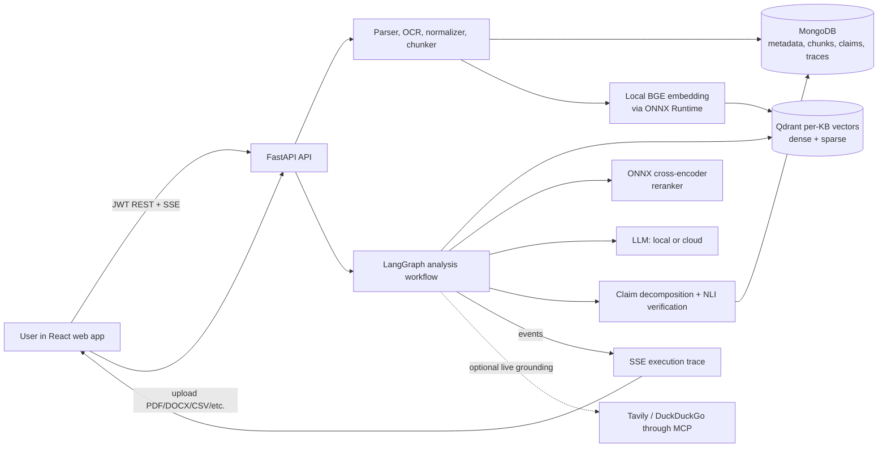
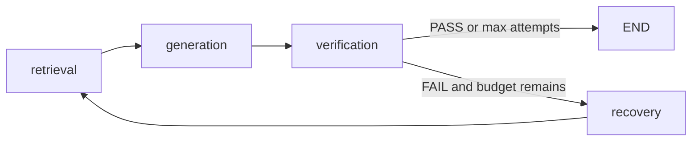

# TRUSTRAG: Complete Project Explanation

> **Purpose of this document.** This is a code-first walkthrough for a person who did not build the system. It was prepared from the implementation, configuration, deployment files, scripts, and frontend source—not by treating the root README or automated tests as the explanation. It explains what the running code does, why each major component exists, how to demo it, and what its limits are.

## 1. One-sentence description

**TRUSTRAG is a full-stack “reliability workbench” for question answering over a user's own documents.** Instead of only generating an answer, it retrieves source passages, asks an LLM to answer from those passages, breaks the answer into atomic claims, verifies each claim against evidence, calculates a trust verdict, stores the audit trail, and shows it in a React web interface.

The project is therefore more than a chatbot. Its central question is: **“Can this answer be traced back to evidence, and do the individual facts agree with that evidence?”**

## 2. The problem it is trying to solve

Large language models are fluent but can state plausible false information. This is called hallucination. Plain RAG (Retrieval-Augmented Generation) improves this by giving the model relevant document passages, but plain RAG still has gaps:

- a retrieved passage may be irrelevant or outdated;
- the model can use a fact not contained in a passage;
- an answer may mix supported and unsupported statements;
- users often see only the answer, not the reason it should be trusted;
- if a source changes, cached answers and old vectors can become misleading.

TRUSTRAG addresses these gaps with a pipeline of **ingestion → retrieval → grounded generation → claim verification → reliability decision → traceable UI**. It is designed for internal policies, manuals, reports, compliance material, and other document collections where an answer must be explainable.

## 3. Terms to know before explaining the project

| Term | Meaning in this project |
|---|---|
| LLM | A generative language model. TRUSTRAG can call local Ollama, llama.cpp, or MLX servers, and can optionally use Gemini or NVIDIA NIM. |
| RAG | Retrieval-Augmented Generation: retrieve relevant document chunks first, then give them to the LLM as context. |
| Embedding | A fixed-length numeric vector representing the meaning of text. Semantically similar text should have nearby vectors. |
| Dense retrieval | Search by embedding similarity. It is useful when wording differs but meaning is similar. |
| Sparse retrieval | Keyword-style search represented as sparse weighted token vectors. It is useful for exact terms, names, codes, and numbers. |
| Hybrid retrieval | Dense and sparse search together, combined with a rank-fusion method. The implementation supports it, although the checked-in configuration currently sets `sparse_top_k: 0`, so the default run is dense-only unless configuration changes. |
| RRF | Reciprocal Rank Fusion. It combines rank positions rather than trying to compare raw scores from unrelated search methods. |
| Reranker | A slower but more accurate second-stage model that scores a `(question, candidate passage)` pair and reorders candidates. |
| NLI | Natural Language Inference: classify a claim as supported, contradicted, or neutral with respect to supplied evidence. |
| ONNX | An interoperable model format; ONNX Runtime runs the exported neural networks efficiently without loading PyTorch in the API process. |
| Knowledge base (KB) | A user-owned collection of documents. Each KB gets its own Qdrant vector collection. |
| Chunk | A small overlapping part of one document page, stored with text and provenance such as page and character offset. |
| Provenance | The ability to trace a displayed claim or answer back to the exact evidence chunk, document page, version, and—when OCR was used—page image. |

## 4. What is in the repository

```text
TrustRAG/
├── apps/
│   ├── api/                 Python FastAPI backend
│   │   ├── app/             production application code
│   │   └── config/models.yaml central model and RAG policy
│   └── web/                 React + Vite workbench UI
├── config/ports.yaml        canonical port assignments
├── scripts/                 setup, ONNX export, model bootstrap, evaluation helpers
├── docs/                    architecture, security, deployment, performance notes
├── load-test/smoke.js       k6 smoke-load scenario
├── docker-compose.yml       local multi-container launch
└── .env.example             environment-variable template; copy to .env, do not commit secrets
```

The two important running applications are:

1. **`apps/api`** – the backend, REST API, RAG pipeline, data persistence, model clients, and MCP server.
2. **`apps/web`** – the browser interface for authentication, KB management, document upload, analysis, evidence/claim inspection, traces, models, and settings.

## 5. Architecture at a glance



### Why MongoDB and Qdrant are both needed

They have different responsibilities; one does not replace the other.

| Store | What it holds | Why |
|---|---|---|
| MongoDB | users, KBs, document metadata, canonical chunk text, evidence records, claims, analysis results, trace events, recovery runs, revoked tokens, experiments, feature flags | flexible application records, ownership checks, audit history, and relationships |
| Qdrant | one `kb_<id>` collection per knowledge base containing dense vector, sparse vector, and retrieval payload | fast nearest-neighbour and sparse-vector search |
| SQLite files | persistent embedding cache | avoids recomputing local ONNX embeddings across process restarts |
| JSON semantic cache | similar-query cached answer payloads | saves repeat answer generation, while retrieval and verification still rerun for auditability |
| local disk | OCR page images | lets the evidence UI show the image actually used to read a scanned page |

## 6. End-to-end user journey

### A. Create an account and a knowledge base

The UI registers or logs in a user, receives a signed JWT, and stores it in browser `localStorage`. Axios adds it as `Authorization: Bearer <token>` to API calls. The server hashes passwords with bcrypt (12 rounds), validates the JWT signature, issuer, audience, expiry, revocation status, and user activity before allowing protected actions.

Creating a KB creates a MongoDB record owned by the current user. The KB is later pinned to the active embedding model and dimensionality. This protects against mixing vectors produced by different embedding models in the same search space.

### B. Upload or import a document

The backend accepts PDF, TXT, Markdown, DOCX, CSV, JSON, HTML, and HTM (up to the configured 20 MB). It checks filename/format, magic bytes, suspicious compression ratios, and a basic EICAR malware signature before parsing. URL ingestion performs URL sanitisation and SSRF defences: allowlisting, blocked private/local addresses, DNS resolution checks, pinned network transport, redirect limits, timeout, and content-size controls.

The parser returns page objects, not merely one long string. It extracts `effective from:` and `effective until:` dates when present. For PDFs it extracts native text page by page. Pages with too little native text can be rendered at 200 DPI and read using RapidOCR powered by ONNX Runtime. OCR text below the configured confidence threshold is discarded rather than becoming evidence.

### C. Create chunks and indexes

The selected chunking strategy turns each page into chunks, by default roughly 512 characters with 64-character overlap. Chunks retain page number, character offset, detected zone, OCR information, and page image bytes. The default strategy snaps window boundaries to spaces so it does not break words.

Each chunk is first persisted as canonical data in MongoDB and then indexed in Qdrant. The dense input includes a contextual prefix such as `[filename | TITLE] text`; this gives ambiguous fragments a little document context without an extra LLM call. The sparse vector deliberately uses the raw chunk text, so filenames do not unfairly dominate keyword search.

### D. Ask a question

The playground posts an `AnalysisCreate` request with KB id, query, optional provider/model, and optional web-search setting. The server creates an analysis record and starts the background pipeline. The frontend immediately opens an SSE stream using a short-lived one-time stream ticket instead of placing the JWT in the URL.

### E. Inspect an audited answer

The response is not just prose. The result screen exposes:

- the grounded answer;
- evidence chunks with page, document, score, OCR/page-image provenance;
- atomic claims marked `SUPPORTED`, `CONTRADICTED`, or `NEUTRAL`;
- reliability status and score;
- diagnosis/recovery history; and
- an execution trace streamed while the workflow runs.

## 7. Ingestion in depth

### 7.1 Parsing and safety

`app/ingestion/parser.py` is the format gateway.

- **PDF:** PyMuPDF extracts per-page text. The code limits PDFs to 500 pages and limits rendered OCR images to 25 megapixels to control memory use.
- **DOCX:** uses protected XML handling (`defusedxml`) and extracts paragraphs/tables.
- **CSV:** parses structured rows into searchable text.
- **JSON:** parses JSON text to a safe readable representation.
- **HTML:** a small HTML parser strips markup and yields text.
- **TXT/MD:** detects encoding with `chardet` and decodes it.

The code also checks decompression-bomb ratios and total decompressed size. These controls matter because a document upload endpoint is an attack surface, not just a convenience feature.

### 7.2 Text normalisation and zones

`app/ingestion/preprocessor.py` normalises Unicode, whitespace, hyphenation and contractions. It contains a Porter stemmer and stop-word logic shared by indexing and searching; sharing the same preprocessing prevents an indexing/search mismatch.

`detect_chunk_zone()` categorises chunks as title, header, table, list, body, or footer-like content. Sparse retrieval applies zone boosts: title terms have stronger weight and header terms are boosted. This is a simple, useful heuristic because headings often express the topic of the following passage.

### 7.3 Chunking strategies

`models.yaml` selects the strategy. Four implementations exist in `chunking_strategies.py`:

| Strategy | Idea | When it helps |
|---|---|---|
| `sliding_window` (current default) | fixed overlapping windows, word-boundary safe | predictable general-purpose default |
| `semantic` | starts from sentences and joins them within a size budget | prose where sentence boundaries matter |
| `progressive` | uses smaller windows near the start and progressively larger windows | documents whose beginning needs finer detail |
| `layout_aware` | separates table-like and prose blocks and preserves table rows | reports/forms with tables and structured layout |

Changing chunking strategy changes chunk boundaries and therefore requires re-indexing the KB. A citation page/offset is only meaningful relative to the chunks that produced it.

### 7.4 Indexing lifecycle

`app/ingestion/pipeline.py` serialises ingestion per event loop with a semaphore so simultaneous uploads do not overwhelm CPU/RAM. It sets document status `pending → processing → completed` (or stores an error). It prevents duplicate Mongo chunks on retries, while deterministic Qdrant point IDs make upserts idempotent.

The Qdrant point id is a deterministic hash of `(document_id, chunk_index)`. The vector payload includes the text and provenance, so a Qdrant hit can immediately become an evidence candidate. Mongo remains the canonical audit copy.

## 8. Retrieval in depth

### 8.1 Dense retrieval

Dense search lives in `app/retrieval/retriever.py`.

1. It obtains a query embedding from the local BGE ONNX model.
2. It checks a 1,024-entry in-memory LRU cache first; the embedding wrapper also has memory and SQLite disk caches.
3. It queries the Qdrant collection’s unnamed dense vector using cosine similarity.
4. It returns Qdrant points and their payloads.

The query embedding has a BGE instruction prefix: `Represent this sentence for searching relevant passages:`. Document embeddings do not. That asymmetry is correct for the BGE retrieval model, and is why the cache explicitly namespaces query vectors separately from document vectors.

### 8.2 Sparse retrieval

Sparse retrieval represents lexical tokens with hashed indices and BM25-style weights. The client applies term-frequency saturation and document-length normalisation. Qdrant applies inverse document frequency (IDF) via the `sparse-text` vector configuration. The token pipeline removes noise and stems words, so, for example, grammatical variants can align.

**Important current configuration fact:** `retrieval.sparse_top_k` is `0` in `apps/api/config/models.yaml`. A zero depth intentionally disables the sparse leg. Thus, the repository implements hybrid dense+sparse RAG, but its default checked-in runtime is dense retrieval plus reranking. To demonstrate true hybrid RAG, set `sparse_top_k` to a positive value (for example 20), re-index if required, and restart/reload configuration.

### 8.3 Reciprocal Rank Fusion (RRF)

When both legs are active, raw dense and sparse scores are not directly comparable. RRF instead uses ranks:

\[
RRF(d) = \frac{1}{k + rank_{dense}(d)} + \frac{1}{k + rank_{sparse}(d)}
\]

with the configured `k = 60`. A document that ranks highly in both lists receives a stronger fused score. This is robust because it does not assume cosine similarities and sparse scores share the same scale.

### 8.4 Query routing and temporal validity

The deterministic router (`app/agent/router.py`) does not spend an LLM call. It identifies simple, temporal, comparison, and complex/multi-question queries. Comparisons and multi-question prompts can fan out into at most three concurrent retrieval queries, then merge results with RRF. Date-like questions can carry a reference time.

After fusion, the retrieval layer reads current document metadata from MongoDB and removes documents outside their `effective_from/effective_until` period. It also drops orphaned Qdrant points whose parent document no longer exists. This prevents stale deleted or time-invalid evidence from being shown just because a vector remains searchable.

### 8.5 Reranking

`app/retrieval/reranker.py` takes the fused candidates and evaluates the actual pair `(question, chunk text)` with the configured cross-encoder. This is more precise than independent embeddings because the model can attend to question and passage together.

The reranker has a bounded candidate depth, batched inference, an LRU score cache, optional early termination for a very confident and separated top result, and adaptive top-k slicing. If the ONNX reranker cannot load, the code fails safely back to RRF order rather than silently loading a different unconfigured model.

## 9. Why ONNX is used in this project

This is a likely faculty question, so it is worth separating **what ONNX is** from **what it does here**.

### What ONNX is

ONNX (Open Neural Network Exchange) is a portable representation for trained neural-network computation graphs. A model can be trained/exported from a framework such as PyTorch, then served by ONNX Runtime. It is not another LLM and it does not “make answers intelligent”; it is an efficient inference format/runtime.

### Where ONNX appears

| Component | Original model | ONNX role |
|---|---|---|
| Embeddings | `BAAI/bge-small-en-v1.5` | produces 384-dimensional, L2-normalised vectors for every document chunk and every query |
| Reranker | `cross-encoder/ms-marco-MiniLM-L-6-v2` | scores query–passage relevance pairs before generation |
| OCR | RapidOCR ONNX Runtime | reads text from scanned PDF pages when native PDF text is insufficient |

### Why it is a good choice here

1. **Lower runtime memory.** The backend comments estimate avoiding PyTorch/sentence-transformers in the API process saves roughly 500–1000 MB RSS. This matters on a laptop or low-RAM server that also runs a local LLM.
2. **CPU-friendly local inference.** Qdrant retrieval requires many embeddings; ONNX Runtime is suitable for efficient CPU execution, including graph optimisation and batched inference.
3. **Offline and no per-query embedding API cost.** Document and query embeddings stay local. The project does not send every document to an embedding cloud service.
4. **Portable deployment.** Docker runtime dependencies are lighter and model artifacts can be prepared once, then reused.
5. **Faster reranking.** The cross-encoder can be int8-quantised during export; the code targets approximately 3–4× CPU speedup versus a PyTorch runtime.
6. **Model behaviour is checked.** The BGE export includes transformer + CLS pooling + L2 normalisation, then verifies numerical parity and unit-length vectors. Exporting only a raw backbone would produce incompatible embeddings and harm retrieval.

### ONNX lifecycle in this repository

The runtime does not train models. A one-time setup path exports/obtains model files in `apps/api/.model_cache`:

```text
scripts/bootstrap.py
    └─ scripts/ensure_onnx_models.py
         ├─ scripts/export_bge_onnx.py       BGE transformer + CLS + L2 normalisation
         └─ app/core/onnx_reranker.py        cross-encoder export + optional int8 quantisation
```

The exporter needs the optional `local-models` dependencies (including PyTorch) **only at export time**. The ordinary API runtime deliberately remains torch-free. On startup `main.py` reports missing ONNX weights; embedding absence makes retrieval fail, while reranker absence degrades to RRF order.

## 10. Grounded generation

`app/generation/generator.py` prepares a tightly controlled prompt. Evidence is sorted deterministically, deduplicated by a normalised prefix, labelled as `Segment 1`, `Segment 2`, and so on, and constrained to an approximately 3,000-character context budget. Whole segments are kept or dropped; it never slices a segment halfway because that would break the link between citation number and evidence item.

The generation prompt tells the LLM to answer only from context, cite supplied segments, avoid invented citations, and abstain when evidence is insufficient. If there are zero chunks, the generator returns `ABSTAIN` without calling an LLM.

The generator also:

- calculates a provider-aware context window (`num_ctx`) from estimated tokens;
- uses provider-specific invocation parameters so local-only options are not sent to cloud APIs;
- optionally supports context compression, but it is disabled by default because a compression call costs another LLM invocation;
- removes model reasoning scaffolding such as `[ANSWER]`, `[FINAL_ANSWER]`, and `<think>...</think>` before verification/UI;
- removes invalid segment citations not present in the actual prompt.

Supported LLM providers are Ollama, llama.cpp, MLX, Gemini, and NVIDIA NIM. The checked-in default generator and verifier are both llama.cpp using the small local `LiquidAI/LFM2.5-1.2B-Instruct-GGUF:Q4_K_M` model. Environment variables can override these choices; cloud models are allowlisted in configuration.

## 11. Claim verification and the trust verdict

### 11.1 Why verification happens after generation

Retrieval says “these passages look relevant”; it does not prove every sentence in the answer. TRUSTRAG therefore takes the generated answer and performs a separate claim audit.

### 11.2 The verification procedure

`app/verification/verifier.py` uses structured-output Pydantic schemas.

1. **Decompose:** convert the answer into atomic factual claims. Meta-comments and refusals are filtered.
2. **Verify:** give claims and numbered evidence segments to the verification LLM and request `SUPPORTED`, `CONTRADICTED`, or `NEUTRAL`, including supporting segment numbers and explanation.
3. **Fused fast path:** the default configuration enables a single structured “decompose and verify” call. If it fails entirely, the code falls back to decomposition plus batch NLI; individual NLI is a bounded fallback.
4. **Targeted recovery:** for a bounded number of neutral claims, it may retrieve evidence specifically for that claim and verify again.
5. **Persist:** claims and their evidence references are saved in MongoDB. Segment numbering is carefully mapped back through context sorting/deduplication to the correct evidence record.

There are caps: default maximum verification claims is 8, individual fallback is bounded to 8, and claim-specific extra retrieval is bounded to 3. These prevent a long answer from generating an unlimited number of expensive LLM calls.

### 11.3 Reliability calculation

Let `S` be supported claims, `C` contradicted claims, and `T` total claims:

\[
coverage = S/T
\]

\[
contradiction\ rate = C/T
\]

\[
reliability\ score = coverage \times (1 - contradiction\ rate)
\]

The active thresholds are:

- minimum evidence coverage: **0.80**;
- maximum contradiction rate: **0.20**;
- abstention/failed boundary: **0.50**.

An answer passes only if coverage is at least 0.80 and contradiction rate is at most 0.20. The user-facing states are `TRUSTED`, `UNCERTAIN`, `FAILED`, and `ABSTAINED`.

**Do not call this score a calibrated probability.** The configuration explicitly says these are engineering thresholds, not statistically calibrated probabilities. A score of 0.80 means the system’s rule computed 0.80 from claim outcomes; it does not mean “80% chance the answer is true.”

## 12. The LangGraph agentic recovery workflow

`app/agent/graph.py` defines a LangGraph state machine:



The state holds analysis/user/KB ids, original and current query, answer, chunks, evidence ids, claims, attempt count, provider/model choice, cache state, diagnosis, errors, and recovery token/latency budgets.

Recovery is not random. It maps diagnosis to a strategy:

| Diagnosis | Intended recovery |
|---|---|
| no/insufficient retrieval evidence | query rewrite |
| low coverage or evidence conflict | widen/re-retrieve |
| generation or verification error/timeout | regenerate using existing chunks |

The configured maximum is two recovery attempts, 2,000 estimated recovery tokens, and 180 seconds of recovery latency. A regeneration reuses existing evidence so it does not waste retrieval/reranker work. A retrieval outage is treated as an infrastructure problem, not as proof that no evidence exists; the user receives a clear service-unavailable message and the loop terminates.

The pipeline also has a self-healing path: when Qdrant has no points but MongoDB has persisted chunks, it can re-embed and re-upsert Mongo chunks in batches of 128 before retrying retrieval. That is a pragmatic recovery mechanism after a vector collection loss.

## 13. Caching, budgets, performance, and resilience

| Mechanism | Implementation purpose |
|---|---|
| embedding LRU + SQLite cache | prevents repeated ONNX computation; query/document namespaces avoid the BGE-prefix mix-up |
| reranker LRU cache | avoids rescoring an identical query/chunk pair |
| semantic cache | can reuse an answer for a similar query, but still retrieves and verifies fresh evidence before trusting it |
| deterministic evidence ordering | produces stable prompts and helps local LLM KV/prompt caching |
| global concurrency semaphore | adjusts local model load to available memory |
| ingestion semaphore | prevents several embedding-heavy uploads from exhausting local resources |
| timeouts | retrieval branches, total hybrid retrieval, LLM nodes, and NLI calls have bounded waits |
| LLM ledger | caps cloud-provider calls per analysis at 24, tracking input/output token usage when available |
| adaptive top-k | if RRF confidence is strong, reduces candidate/context width to save latency/tokens |
| resource endpoints | hardware profiling and explicit memory trim are exposed to the authenticated settings UI |

The application records Prometheus-style counters for HTTP requests, analyses, recovery attempts, verification outcomes, estimated tokens, and budget rejections. `/api/v1/metrics` emits the text format.

## 14. API map

All normal routes begin with `/api/v1`.

| Area | Main endpoints | Purpose |
|---|---|---|
| Health | `GET /health`, `/health/detailed`, `/metrics` | public liveness, authenticated dependency/model details, Prometheus metrics |
| Auth | `POST /auth/register`, `/auth/login`, `/auth/logout`; `GET /auth/me` | user accounts and JWT sessions |
| Knowledge bases | `POST/GET /knowledge-bases`; `GET/DELETE /knowledge-bases/{id}` | KB management |
| Documents | `POST /knowledge-bases/{id}/documents`; `POST .../from-url`; `GET .../documents`; `GET/DELETE /documents/{id}` | ingest and manage documents |
| Snapshots | `POST /knowledge-bases/{id}/snapshots`; `POST /{id}/rollback/{snapshot}` | copy KB state/version and restore it |
| Analyses | `POST/GET /analyses`; `GET /analyses/{id}`, `/detail`, `/claims`, `/evidence`, `/trace`, `/export` | run and inspect audit workflow |
| Live trace | `POST /analyses/{id}/stream-ticket`, `GET /analyses/{id}/stream?ticket=...` | short-lived ticket then SSE events |
| Evidence/claims/conflicts | `GET /evidence`, `/claims`, `/conflicts` | cross-analysis audit views |
| Models | `GET /models/providers`, `/models/hardware`; `POST /models/memory/trim` | model/provider and hardware diagnostics |
| Experiments | `POST/GET /experiments`, `GET /experiments/{id}`, `GET /experimentation/flags` | experiment records and feature flag visibility |
| Internal | `/internal/*` | service-token-only ingestion, search, verification, health/status interfaces |

Pydantic schemas validate body shape, maximum query length (2,000 characters), provider/model selections, and other data contracts before business logic executes.

## 15. Security design actually present in the code

Security is not the project’s main product feature, but it is implemented throughout the backend.

- bcrypt password hashes; new passwords must meet complexity rules and stay below bcrypt’s 72-byte limit.
- JWT HS256 with issuer, audience, expiration, issue time, and unique `jti`; logout places the `jti` in a MongoDB denylist.
- user ownership checks on KBs, documents, analyses, evidence, and claims.
- distinct service JWTs with permissions and optional KB/user tenancy binding for internal endpoints and external MCP calls.
- restricted CORS origins; gzip; request ids; structured logs that scrub known secret patterns.
- route-specific rate limits for login, analyses, upload, and URL ingestion. The code notes production multi-worker deployments should use a shared Redis limiter store.
- document validation, decompression limits, OCR render limits, and SSRF controls for URL ingestion.
- stale-evidence guards in retrieval and deletion ordering that tries to remove vectors before destroying metadata where possible.
- user-facing errors are normalised; internal exception details are generally not returned.

One operational note for an explanation: browser JWT storage in `localStorage` is convenient for this prototype but requires strong XSS protections in a production threat model. HTTP-only secure cookies are often preferred for a hardened web deployment.

## 16. Frontend explanation

The frontend is React 18 + Vite, React Router, TanStack Query, Axios, Motion, and Tailwind/CSS. `App.jsx` lazy-loads pages and wraps pages in error boundaries. Protected routes redirect users without a local session to login.

The main pages are:

| Page | Role |
|---|---|
| Landing | marketing/architecture/capability presentation and simulation visuals |
| Login/Register | account creation and session entry |
| Dashboard | analysis history and aggregate reliability views |
| Playground | select KB/model, enter query, launch analysis, receive live trace |
| Knowledge Bases | create KBs, upload/import documents, inspect status, manage document data |
| Evidence | browse persisted evidence across analyses |
| Claims | browse claim-level verification outcomes |
| Conflicts | show contradicted/conflicting material |
| Experiments | record or inspect experiment runs |
| Settings | provider, hardware, model and operational diagnostics |
| Trace | focused view of a run’s execution events |

`lib/api.js` is important: it centralises base URL handling, adds the JWT, correctly removes the JSON content-type for file uploads so browsers create multipart boundaries, clears the session on 401, and converts backend errors into useful display messages. Its SSE helper first requests a stream ticket, protecting the JWT from URL/history/log leakage.

The workbench result panel intentionally presents four views—Answer, Evidence, Claims, Trace—because the project’s value is the connection between them, not just answer text. It can export a JSON-LD audit dossier.

## 17. MCP and web search

The repository contains an MCP stdio server (`app/mcp/server.py`). MCP is a standard tool interface that lets compatible clients use TrustRAG capabilities. It exposes tools for:

- searching a TrustRAG KB;
- verifying claims against supplied evidence;
- listing KBs;
- Tavily search, DuckDuckGo search, and hybrid web search;
- a local-LLM chat call; and
- local LLM status.

External MCP tool calls require a service token. Bound service tokens are limited to their KB/user scope. The in-process analysis pipeline can optionally call the web-search tools for live grounding. Web snippets are turned into evidence-like chunks, audited, and presented separately from KB material. Web search is optional and should not be described as a replacement for authoritative uploaded documents.

## 18. Configuration and deployment

### Configuration hierarchy

- `apps/api/config/models.yaml`: versioned non-secret policy—models, retrieval widths, chunking, verification thresholds, recovery budgets, and optimisation switches.
- `.env`: deployment secrets and override values such as `JWT_SECRET`, `MONGODB_URI`, API keys, CORS origins, and server URLs.
- `config/ports.yaml`: canonical ports. `scripts/apply_ports.py` propagates a port change to related files.

Environment values win over YAML defaults. This is useful for choosing a different provider in deployment, but it means the startup log is the best source for the **effective** model configuration.

### Docker compose

`docker-compose.yml` starts:

- Qdrant: host HTTP port 6335 mapped to container 6333;
- FastAPI: port 8000;
- Vite frontend: port 5173.

MongoDB and optional local LLM servers are expected on the host and reached from Docker using `host.docker.internal`. Qdrant storage and model-cache data use named volumes. The Docker API runtime is non-root and intentionally does not package PyTorch; ONNX artifacts must be prepared/baked as part of setup.

### Minimal local setup sequence

1. Copy `.env.example` to `.env`; provide a strong `JWT_SECRET` and a MongoDB URI.
2. Ensure MongoDB is running and start Qdrant (Docker compose can do this).
3. Install backend dependencies. For a first ONNX export, install the optional local-model export dependencies too.
4. Run `python scripts/bootstrap.py` to prepare ONNX artifacts and snapshot local model availability.
5. Start a local LLM server matching the selected provider/model, or configure a permitted cloud provider key.
6. Start FastAPI and the Vite web app, then open the frontend on port 5173.

The repository also includes `scripts/start_local_llm.sh` for a llama.cpp server and `scripts/setup.sh` for an automated setup flow.

## 19. What to say in a faculty demo

Use a small set of source documents containing a fact that can be checked, ideally one policy/version that includes an effective date.

1. Create a KB and upload the documents. Explain that upload is not just file storage: the system parses pages, optionally OCRs scans, chunks text, creates local ONNX embeddings, and stores vectors in Qdrant plus audit metadata in MongoDB.
2. Ask a direct question. In the live trace, point out retrieval, reranking, generation, claims, verification, and any recovery event.
3. Open **Evidence** and show the document/page/chunk source. If using an OCR page, show that the system records OCR provenance/page image.
4. Open **Claims** and explain supported/contradicted/neutral. This is the key distinction from an ordinary RAG chatbot.
5. Explain the verdict math and clearly say the score is an engineering reliability indicator, not a probability.
6. If appropriate, enable real hybrid retrieval (`sparse_top_k > 0`) and explain dense semantic search + sparse exact-term search + RRF.
7. Explain ONNX: it keeps embedding/reranking/OCR local and efficient without loading PyTorch in the serving process.
8. Show the export button and describe it as an auditable dossier rather than an opaque chatbot reply.

## 20. Honest limitations and improvement opportunities

An effective project explanation includes boundaries.

- **Verification is LLM-based.** NLI improves accountability but is not a formal proof system; a weak local verification model can still misclassify a claim.
- **Default sparse search is disabled.** The code supports hybrid retrieval but the current `sparse_top_k: 0` setting means a default demo should not claim both dense and sparse search are actively contributing unless it is changed.
- **The reliability score is uncalibrated.** It should be framed as a rule-based audit score, not probability/confidence truth.
- **Chunking governs evidence quality.** Poor OCR, poorly structured source documents, or a chunk boundary that separates required context can reduce performance.
- **Small local LLMs are economical, not necessarily strongest.** The default 1.2B llama.cpp model enables low-resource operation; larger/local/cloud models may improve generation and verification at a cost.
- **Semantic cache is carefully reverified but is still an optimisation.** Operationally, cache invalidation and KB versioning deserve monitoring in any production use.
- **MongoDB is external to the compose stack.** A one-command production-like deployment would need MongoDB/backup/authentication orchestration too.
- **Snapshots copy data and vectors.** They are useful for rollback but consume storage and should be managed with retention policy.
- **UI token storage can be hardened.** HTTP-only cookies and CSP/XSS controls would strengthen production authentication.

## 21. Code navigation map

This map lets a presenter answer “where is that implemented?” without relying on this guide alone.

| Concern | Main implementation files |
|---|---|
| app startup, middleware, error mapping | `apps/api/app/main.py`, `app/api/router.py` |
| central settings/model policy | `app/core/config.py`, `apps/api/config/models.yaml`, `.env.example` |
| model selection/local LLM clients | `app/core/model_registry.py`, `app/core/local_llm.py`, `app/core/llm_utils.py`, `app/core/llm_ledger.py` |
| ONNX embedding/reranking/cache | `app/core/onnx_embeddings.py`, `onnx_reranker.py`, `disk_cache.py`, `scripts/ensure_onnx_models.py`, `scripts/export_bge_onnx.py` |
| document parsing/OCR/chunking | `app/ingestion/parser.py`, `ocr.py`, `preprocessor.py`, `chunker.py`, `chunking_strategies.py`, `page_images.py` |
| indexing/vector DB | `app/ingestion/pipeline.py`, `sparse_vector.py`, `app/db/qdrant.py`, `app/db/mongodb.py` |
| retrieval/reranking/router | `app/retrieval/retriever.py`, `reranker.py`, `app/agent/router.py` |
| answer generation | `app/generation/generator.py` |
| verification/verdict/provenance integrity | `app/verification/verifier.py`, `verdict.py`, `integrity.py` |
| agent workflow/recovery | `app/agent/graph.py` |
| API use cases and persistence orchestration | `app/services/*.py`, `app/api/v1/*.py`, `app/api/v1/schemas/*.py` |
| security/rate limits/logging/metrics | `app/core/security.py`, `rate_limiter.py`, `logging.py`, `tracing.py`, `metrics.py`, `exceptions.py` |
| external tool/MCP bridge | `app/mcp/server.py`, `client.py`, `app/services/search_service.py` |
| React routes and API transport | `apps/web/src/App.jsx`, `main.jsx`, `lib/api.js`, `services/*.js`, `store/authStore.js` |
| workbench/visual UI | `apps/web/src/pages/*.jsx`, `components/workbench/*.jsx`, `layouts/*.jsx`, `styles/*.css` |
| deployment/ports/scripts | `docker-compose.yml`, `apps/api/Dockerfile`, `config/ports.yaml`, `scripts/*.py`, `scripts/*.sh` |

## 22. Final project summary

TRUSTRAG is best presented as an **auditable, local-first RAG reliability system**. Its differentiators are not only “it uses a vector database” or “it calls an LLM.” Its practical contribution is the chain:

```text
source document → page/chunk/version → retrieval + reranking → grounded answer
→ atomic claims → evidence-based verdict → visible trace and exportable audit dossier
```

ONNX makes the recurring local ML steps—embedding, reranking, and OCR—efficient enough to coexist with a local LLM on modest hardware. Qdrant makes semantic/lexical retrieval fast. MongoDB preserves the business data and audit relationships. LangGraph supplies a bounded recovery workflow. FastAPI exposes the system safely, and the React workbench lets a user inspect why an answer was considered trustworthy rather than accepting it blindly.
