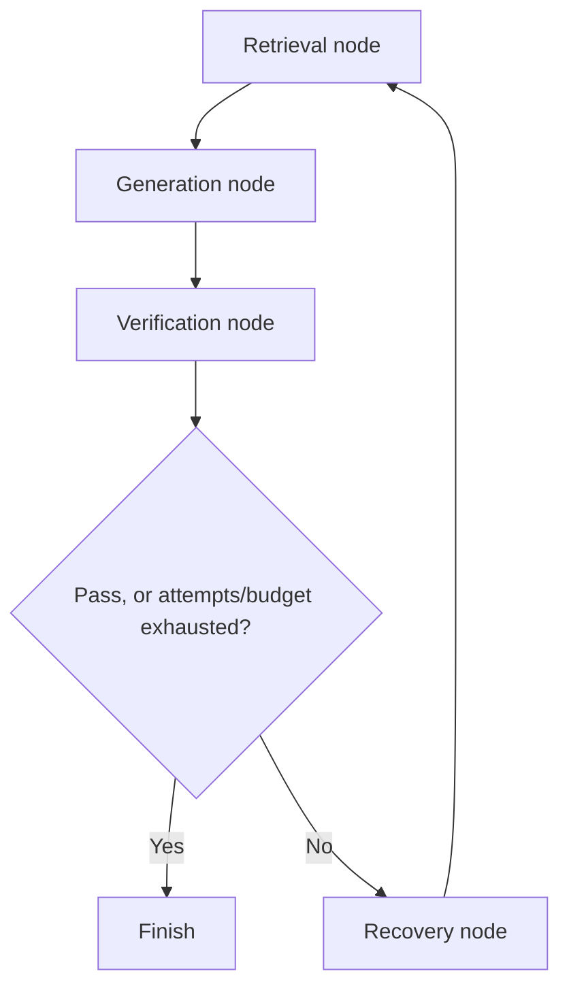

# TRUSTRAG RAG Deep Dive

## A beginner-to-mentor guide to the complete retrieval, generation, and verification pipeline

This guide explains the RAG subsystem by following the code and configuration. It assumes no prior knowledge of RAG, embeddings, ONNX, LangGraph, NLI, or MCP. It is intended to help a presenter understand the design well enough to explain it, answer technical questions, and point mentors to the implementation.

The root project guide covers the whole product. This document concentrates on the AI evidence pipeline: **document preparation, indexing, retrieval, reranking, grounded generation, claim verification, recovery, and traceability**.

---

## 1. What RAG means here

RAG stands for **Retrieval-Augmented Generation**. A normal language model answers using what it learned during training and what the user puts in the prompt. A RAG system first looks up relevant passages in a chosen collection, then gives those passages to the model with the question.

TRUSTRAG adds an audit stage after ordinary RAG. It does not consider a fluent answer sufficient. It tries to connect answer claims to retrieved evidence and calculate a rule-based verdict.

```text
Documents
   ↓ parse, clean, chunk, index
Knowledge base search index
   ↓ question → retrieve passages → rerank
Evidence context
   ↓ LLM answers from this context
Draft answer
   ↓ decompose into claims → verify claims against passages
Answer + evidence + claims + verdict + trace
```

The project’s central design goal is **inspectability**: a user can see which passages were found, what the answer claimed, which claims were supported or contradicted, and what pipeline events occurred.

### What RAG does not guarantee

RAG improves grounding but does not mathematically guarantee truth. Search can miss the right passage; a source can itself be wrong; a model can misunderstand the evidence; and a language model doing NLI can misclassify entailment. TRUSTRAG makes those steps visible and bounded, but the result remains an AI-assisted audit rather than a formal proof.

---

## 2. The vocabulary, from first principles

### Document and chunk

A **document** is an uploaded source, such as an API reference or a policy PDF. A **chunk** is a smaller passage extracted from it. Search works on chunks because a whole 100-page PDF is too large and imprecise to send to a model for every question.

Chunks keep source metadata: document id, page, chunk index, character offset, detected content zone, effective dates, version, and OCR provenance. This metadata is what later enables an evidence panel to point back to a source.

### Token and embedding

A **token** is a piece of text used by language models and tokenizers. It may be a whole word, part of a word, punctuation, or a special marker.

An **embedding** is a list of numbers representing text. TRUSTRAG uses BGE-small to turn each passage and question into a 384-number vector. The intent is that semantically related text has vectors pointing in similar directions. For example, “How long are tokens valid?” may be close to a passage headed “Token lifetime” even when the words differ.

### Dense search

Dense search compares embedding vectors. It is good at meaning and paraphrase. It can be weaker for exact identifiers, rare names, or precise numbers.

### Sparse search

Sparse search represents only terms present in the text, with weights. It behaves more like a sophisticated keyword search. It is good when the query and passage share distinctive words, names, product codes, or phrases.

### Hybrid search

Hybrid search runs dense and sparse searches, then combines their ranked lists. It can cover both semantic similarity and exact vocabulary. **The implementation supports this, but current configuration sets `retrieval.sparse_top_k: 0`, which disables the sparse search branch by default.** Therefore, describe the code as hybrid-capable, but describe the default run as dense retrieval followed by reranking unless sparse depth has been enabled in the active configuration.

### Reranking

A reranker receives both the question and a candidate passage at once and estimates how relevant that pair is. Retrieval cheaply finds candidates; reranking spends more computation to order the strongest candidates more carefully.

### NLI

Natural Language Inference asks whether a premise supports, contradicts, or says too little about a hypothesis. In this project, the evidence passage(s) are the premise and an answer claim is the hypothesis. The expected labels are `SUPPORTED`, `CONTRADICTED`, and `NEUTRAL`.

---

## 3. The RAG system’s major parts

| Responsibility | Main code |
|---|---|
| Parse and validate uploaded files | `apps/api/app/ingestion/parser.py` |
| Normalize, classify chunks, lexical preprocessing | `apps/api/app/ingestion/preprocessor.py` |
| Split text into chunks | `apps/api/app/ingestion/chunker.py`, `chunking_strategies.py` |
| OCR scanned pages and preserve images | `apps/api/app/ingestion/ocr.py`, `page_images.py` |
| Generate sparse vectors | `apps/api/app/ingestion/sparse_vector.py` |
| Create embeddings and index chunks | `apps/api/app/ingestion/pipeline.py` |
| Connect/create per-KB vector collections | `apps/api/app/db/qdrant.py` |
| Persist app records and canonical chunks | `apps/api/app/db/mongodb.py` |
| Make dense/sparse searches and fuse ranks | `apps/api/app/retrieval/retriever.py` |
| Deterministic query routing and fan-out | `apps/api/app/agent/router.py` |
| Cross-encoder reranking | `apps/api/app/retrieval/reranker.py` |
| Format evidence prompt and generate answer | `apps/api/app/generation/generator.py` |
| Orchestrate analysis, persistence, SSE, recovery runs | `apps/api/app/services/analysis_service.py` |
| Run retrieval/generation/verification/recovery graph | `apps/api/app/agent/graph.py` |
| Decompose/verify answer claims | `apps/api/app/verification/verifier.py` |
| Check retrieved text against canonical hash | `apps/api/app/verification/integrity.py` |
| Calculate trust result | `apps/api/app/verification/verdict.py` |
| Model configuration/runtime registry | `apps/api/app/core/config.py`, `model_registry.py` |
| ONNX runtime wrappers | `apps/api/app/core/onnx_embeddings.py`, `onnx_reranker.py` |
| MCP tools and web search | `apps/api/app/mcp/server.py`, `client.py`, `services/search_service.py` |

---

## 4. Storage: why there are two databases

The RAG system uses MongoDB and Qdrant for different jobs.

### MongoDB: the application record and audit store

MongoDB holds records such as users, knowledge bases, documents, parsed chunks, analysis runs, retrieved evidence, claims, trace events, recovery attempts, and revoked tokens. It is the source for ownership, metadata, audit history, and claim-to-evidence relationships.

The `document_chunks` collection stores canonical chunk text plus a SHA-256 text hash. This matters because the Qdrant payload is optimized for retrieval, whereas Mongo is used to check that a returned passage matches the stored source chunk.

### Qdrant: the searchable vector index

Qdrant stores one collection named `kb_<knowledge_base_id>` per KB. A point contains a dense vector, a named `sparse-text` vector, and a payload with chunk text and metadata. This allows fast vector search and gives the backend enough information to form candidate evidence records.

### The relationship

```text
MongoDB document_chunks ── canonical text + hash + metadata
            │
            └── indexed into Qdrant ── vectors + text payload for fast search
```

MongoDB is not the nearest-neighbor index; Qdrant is not the full audit database. Using both makes retrieval efficient while retaining canonical text and application relationships.

---

## 5. Stage one: preprocessing and document ingestion

Ingestion occurs when a user uploads a file or submits a URL. It converts source material into normalized, page-aware passages that can be indexed.

### 5.1 Accepted formats and input checks

The parser supports PDF, TXT, Markdown, DOCX, CSV, JSON, HTML, and HTM. The configured maximum file size is 20 MB. Before extracting content, it checks filename/extension against file magic bytes, applies decompression-size and ratio guards, and includes a basic EICAR signature scan.

These checks matter because uploaded files are untrusted input. A ZIP-based office file or compressed document can expand dramatically; a file can have a misleading extension; malformed XML can exploit unsafe parsers. The checks reduce those risks before content enters the RAG pipeline.

URL ingestion has a different threat: server-side request forgery (SSRF). The URL fetcher validates the URL, checks the resolved addresses, rejects local/private destinations, controls redirects, pins the network destination, sets timeouts, and bounds content size. That keeps a user-provided URL from being used to probe internal services.

### 5.2 Parsing page structure

`parse_document()` dispatches to format-specific handlers. PDF parsing returns separate page records. DOCX parsing extracts paragraphs and tables. CSV and JSON are rendered into text. HTML tags are removed. Text files use encoding detection.

The page boundary is preserved because evidence needs a page number. The parser also searches for date phrases such as `effective from: 2025-01-01` and `effective until: 2025-12-31`; those dates can later filter evidence for a point in time.

### 5.3 Native text versus OCR

For a text-based PDF, PyMuPDF can extract the actual characters. A scanned PDF may instead contain page images with no usable text. TRUSTRAG checks whether a page has enough native text (configured minimum: 50 characters). If not, and OCR is enabled, it renders the page at the configured 200 DPI and runs RapidOCR using ONNX Runtime.

OCR returns text and a confidence estimate. Text below the configured 0.5 confidence threshold is dropped so weak recognition is not silently treated as reliable evidence. When configured, page renders are saved once per page; chunks from that page reference the saved image. This enables the chain:

```text
answer claim → evidence chunk → source document/page → OCR page image (when applicable)
```

OCR is not used on every page. Native text extraction is cheaper and preferable when available.

### 5.4 Normalisation and lexical analysis

`preprocessor.py` contains shared text cleanup and token preparation. It handles Unicode and whitespace normalization, de-hyphenation/contraction cases, stopwords, and a Porter stemmer. The lexical-analysis function is used by sparse indexing and query search so both sides apply compatible transformations.

For example, stemming can help align `limits` and `limit`; stopword removal reduces the influence of generic words. Query preprocessing can remove conversational filler that does not help locate passages.

The preprocessor also detects a zone for each chunk, such as title, header, table, list, body, or footer. Sparse weights can boost title and header words because those often describe what a section is about. Zone detection is heuristic, so it can occasionally classify a passage incorrectly.

### 5.5 Chunking: why and how

The language model has a finite prompt window, and retrieval needs to rank focused passages. Chunking breaks a large source into smaller units while retaining enough surrounding context.

The current default is `sliding_window`, with 512 characters and 64 characters of overlap. With this configuration, the next chunk begins roughly 448 characters after the previous start, adjusted for word boundaries. Overlap helps when a sentence or fact crosses a chunk boundary: at least some context appears in both neighbouring chunks.

`chunker.py` records:

- text;
- page number;
- a document-level chunk index;
- character offset within the page;
- detected zone;
- OCR-used flag and confidence; and
- optional page-image bytes during ingestion.

Offsets account for trimmed leading whitespace and are rebased for layout-aware sub-blocks. This prevents evidence highlighting from pointing to the wrong source span.

Four strategies are implemented:

| Strategy | Behavior | Tradeoff |
|---|---|---|
| `sliding_window` | Fixed-size overlapping windows with word-boundary snapping | Stable and general, though a chunk can cross a topic boundary |
| `semantic` | Sentence-aware grouping within size limits | Better prose boundaries; depends on sentence splitting and can vary chunk length |
| `progressive` | Grows the window size as it moves through each page | Provides finer early chunks and larger later chunks, but less uniform indexing |
| `layout_aware` | Groups table-like rows and prose separately | Preserves table structure better, but uses layout heuristics |

Changing the strategy changes every chunk boundary. Existing vectors therefore need re-indexing to use the new strategy consistently.

### 5.6 Ingestion/indexing persistence

The API route validates the KB and upload, parses the file, computes a content hash for deduplication, creates a document record, chunks it, and schedules the indexing path. The ingestion semaphore limits simultaneous heavy ingestion work per event loop.

`pipeline.py` then:

1. marks the document `processing`;
2. checks that the KB’s pinned embedding model matches the active model;
3. stores canonical Mongo chunks and their text hashes;
4. creates/ensures the Qdrant collection;
5. adds filename and zone context to the dense embedding input;
6. produces dense vectors and sparse vectors;
7. writes Qdrant points in batches; and
8. marks the document `completed` (or records a failure).

Qdrant point IDs are deterministic hashes of `(document_id, chunk_index)`. Re-indexing therefore updates the same point rather than creating duplicate points. Mongo chunks are deleted for that document before a retry inserts the canonical fresh set.

The KB pin prevents mixing different embedding spaces. If one document were indexed with model A and another with model B, their numeric coordinates would not mean the same thing. Similarity search across them could return plausible-looking but meaningless rankings.

---

## 6. Stage two: ONNX models used by RAG

### 6.1 ONNX, in simple terms

ONNX means Open Neural Network Exchange. It is a portable description of a neural network’s operations and weights. A model may be exported from PyTorch and then executed by ONNX Runtime.

ONNX is not an LLM, an embedding algorithm, or a database. It is the runtime format used for some neural models in this project.

### 6.2 Three ONNX uses in this codebase

| Task | Model/runtime | RAG role |
|---|---|---|
| Text embeddings | BGE-small-en-v1.5 through `ONNXBGEEmbeddings` | turns chunks and questions into vectors for dense retrieval |
| Reranking | MS MARCO MiniLM cross-encoder through `ONNXCrossEncoder` | re-scores candidate question/passage pairs |
| OCR | RapidOCR ONNX Runtime | recognises text on scanned PDF pages |

The generative model is a separate system. The default LLM is a llama.cpp hosted model; it is not the ONNX embedding model.

### 6.3 Why use ONNX here

- The API can run embedding/reranking/OCR without importing PyTorch into its serving runtime. The source comments estimate roughly 500–1000 MB lower memory use than a PyTorch/sentence-transformers serving path.
- CPU inference is practical for a local-first application, particularly when a local generative model also uses memory and compute.
- Embedding stays local and has no per-query third-party embedding bill. This also supports offline/private document indexing after artifacts are prepared.
- The ONNX Runtime session supports batching and graph optimisations. The reranker export optionally uses int8 quantisation for smaller/faster CPU execution.
- Exported artifacts can be reused by Docker deployments; the API image does not need to ship the full export toolchain.

### 6.4 BGE embedding details

`ONNXBGEEmbeddings` loads the Hugging Face tokenizer at a pinned revision and loads the ONNX graph with `CPUExecutionProvider` by default. It tokenizes inputs up to 512 tokens, chunks larger batches into groups of 32, runs inference, and returns float32 vectors.

The query gets the BGE instruction prefix:

```text
Represent this sentence for searching relevant passages: <question>
```

Document passages do not receive this query prefix. The model export uses the BGE model’s CLS pooling and L2 normalization. The resulting vector has 384 dimensions, matching Qdrant configuration.

The embedding cache separates `query` and `document` modes. This is necessary because the same string embedded as a query has a different prefix and hence a different vector than the same string embedded as a document.

### 6.5 Export and readiness

The normal API runtime depends on `onnxruntime` and `transformers`, not the optional PyTorch export dependencies. The optional `local-models` extra provides sentence-transformers, PyTorch-related export dependencies, ONNX, and ONNX Script.

`scripts/bootstrap.py` calls `ensure_onnx_models.py`. That script checks for model artifacts, exports missing models, and verifies the embedding graph’s output dimension and L2 norm. `export_bge_onnx.py` compares ONNX output against the PyTorch wrapper. Startup reports a missing embedding artifact because dense retrieval depends on it. A missing reranker can degrade ranking to the previous order.

**Useful explanation:** “ONNX lets the app run its repeated local text-understanding steps efficiently; it does not generate the final answer. The answer is still written by the configured LLM.”

---

## 7. Stage three: retrieval

### 7.1 Retrieval input and per-user scope

An analysis request includes a KB id. The API verifies the authenticated user owns the KB. Every KB’s Qdrant collection is named from that id, which scopes normal searches to one collection. Service-token paths also enforce optional KB/user bindings.

The analysis service creates an analysis record and calls the agent workflow with query, KB, user, selected LLM provider/model, and optional web-search settings. The agent’s retrieval node is the connection between the workflow and the retrieval package.

### 7.2 Deterministic query routing

`app/agent/router.py` classifies queries without calling an LLM. It can identify:

- a simple question, searched as one query;
- a temporal question, optionally attaching a reference time;
- a comparison such as “A vs B”, split into two retrieval branches; or
- a multi-question query, split at question marks up to a configured maximum of three.

For example, “Compare the 2025 and 2026 rate limits” can run searches for each side concurrently. The results are merged and deduplicated by chunk id, keeping the best RRF score. If one branch fails but another succeeds, the successful branch is used; if every branch fails, the router raises a retrieval outage.

This routing is a deterministic query-shape heuristic. It is not an LLM agent deciding arbitrary tools or plans.

### 7.3 Dense retrieval, step by step

The dense leg in `retriever.py`:

1. obtains the async Qdrant client;
2. gets the target collection’s expected dimension (cached metadata);
3. checks an in-memory query embedding LRU under an `onnx:` namespace;
4. if needed, embeds the query in a worker thread with the cached ONNX model;
5. aligns dimensions as a last-resort compatibility measure, logging mismatch loudly; and
6. calls Qdrant `query_points` using the default dense vector.

The project explicitly treats a real infrastructure failure as `RetrievalOutageError`. An empty successful query means “the index ran and found no matching point”; that is a different result from “Qdrant or the embedding model is unavailable.” This distinction prevents the UI from falsely telling a user there is no evidence when the search service is actually broken.

### 7.4 Sparse/BM25-style retrieval, step by step

The sparse leg uses `generate_sparse_vector()` for both indexing and query-time search.

1. Normalize and tokenize using the shared lexical pipeline.
2. Remove stopwords/noisy conversational tokens and stem terms.
3. Hash each token to an integer feature id using xxHash, capped within a fixed vocabulary range.
4. Count term frequency per feature.
5. Apply BM25-style term-frequency saturation. Repeating a term helps, but with diminishing returns.
6. For documents, apply length normalisation and a zone multiplier. The query side omits length normalisation.
7. Send sparse indices and weights to Qdrant’s `sparse-text` named vector. Qdrant applies IDF from corpus statistics.

An intuitive example: if “SKU-X17” appears in both a question and a passage, sparse matching can find it even if a dense model considers the passage’s surrounding meaning only moderately similar.

### 7.5 BM25 concept and project formula

BM25 is a classic lexical ranking family. Its practical intuition is:

- a term match is useful;
- a term that appears in many documents is less distinctive than a rare term;
- repeated occurrences help, but not linearly forever; and
- very long documents should not win merely because they contain more words.

This implementation computes a client-side TF component:

```text
tf_sat(freq) = freq × (k1 + 1) / (freq + k1)
length_norm = (1 - b) + b × (document_token_length / average_length)
document_weight = zone_boost × tf_sat(freq) / length_norm
```

The default BM25 parameters are `k1=1.2`, `b=0.75`, and average reference length 128 tokens. Qdrant’s sparse index supplies IDF. This is described as BM25-style because the term weighting is split between the client vector and Qdrant’s server-side modifier.

### 7.6 Dense+sparse parallelism and failure handling

`retrieve_hybrid_chunks()` runs the dense and sparse legs concurrently. Each branch has a 45-second timeout, with a 60-second outer budget. A branch timeout can degrade to the other branch; both branches timing out is an outage. `top_k_override` can widen retrieval for recovery.

With `sparse_top_k: 0`, `sparse_search()` returns an empty list immediately and the normal path effectively becomes dense search followed by fusion with an empty list. It is still useful to leave the path implemented for experiments and configuration changes, but the active config should be stated accurately.

### 7.7 RRF: combining ranked lists

Dense and sparse scores live on different scales. Cosine similarity and BM25 weights are not meaningfully comparable as raw numbers. RRF avoids comparing those values directly. For each item it uses its rank in each list:

```text
RRF(document) = 1 / (k + dense_rank) + 1 / (k + sparse_rank)
```

Missing from a list contributes zero. Ranks are one-based; the configured `k` is 60. The fused list sorts by descending RRF score. A passage that ranks near the top in both systems receives a boost because it has independent support from two retrieval signals.

The fusion result also carries original dense/sparse scores, page, text, document id, OCR/version metadata, and the computed `rrf_score`.

### 7.8 Temporal filter and stale-point guard

After fusion, the backend batch-fetches parent document records from MongoDB. It attaches the authoritative filename, effective dates, version, and snapshot status. It removes a result when the requested reference time precedes `effective_from` or follows `effective_until`.

If a Qdrant point refers to a document that no longer exists, the point is dropped as an orphan. This prevents stale vectors from returning evidence after the source record is removed. Legacy points without a document id are handled separately because their parent cannot be checked.

### 7.9 Candidate depth and adaptive top-k

The checked-in defaults are dense top-k 20, fusion top-k 20, and max context chunks 8. If the highest RRF score crosses the implementation’s high-confidence threshold (0.02 in RRF units), it can reduce the fused list to four. The score threshold is deliberately expressed in RRF scale: with `k=60`, a top-ranked result in both legs can score around `2/61`, or about 0.033.

The intention is to spend less on reranking and context when the first evidence is already strong. This is a heuristic confidence shortcut, not a calibrated probability.

---

## 8. Stage four: cross-encoder reranking

### 8.1 Why there are two relevance stages

Embedding search is fast because document vectors are computed in advance. But the query vector and document vector are encoded separately. A cross-encoder instead reads question and passage together, so it can inspect their interaction more closely. Running a cross-encoder on every KB chunk would be too expensive, so TRUSTRAG uses it only on a small candidate set.

```text
All indexed chunks --cheap vector/lexical search--> top candidates
top candidates --more precise pair scoring--> best evidence context
```

### 8.2 Runtime flow

`rerank_candidate_chunks()` delegates CPU-bound inference to a worker thread. `_rerank_sync()`:

1. caps the candidates using configured reranker depth (at least as wide as fusion/context bounds);
2. forms `(query, text)` pairs;
3. checks a thread-safe LRU cache keyed by a hash of query and passage text;
4. predicts scores for uncached pairs in batches; and
5. sorts candidates by descending `rerank_score`, then slices to the context budget.

The configured cross-encoder is `cross-encoder/ms-marco-MiniLM-L-6-v2`, with ONNX enabled. If the model cannot load or scoring fails, the system logs the issue and returns the previous retrieval ordering. That keeps the run usable, but relevance quality may be lower.

### 8.3 Early termination and limitations

The code supports early stopping when enough candidates have been scored and the top score exceeds a configured threshold with a sufficiently wide gap over second place. It also has adaptive top-k slicing. These improve speed but mean lower-ranked candidates may not all be scored in some cases.

Cross-encoder score is a ranking signal. It should not be shown as “probability this chunk is relevant” unless the model has separately been calibrated.

---

## 9. Stage five: evidence integrity and provenance

`app/verification/integrity.py` provides a check separate from NLI. It matches retrieved chunks to MongoDB by `(document_id, chunk_index)`, reads the canonical SHA-256 hash, hashes the retrieved text, and marks the chunk `VERIFIED` or `CORRUPTED`.

This checks **text identity relative to the stored canonical chunk**. It does not verify that the original document is true or authoritative. It helps catch a stale or altered vector payload and confirms that the text returned from the search index matches the text that was stored at ingestion.

External web results do not have a Mongo document chunk reference, so they are marked `EXTERNAL_UNAUDITED`; they are not falsely described as cryptographically verified. The RAG pipeline filters regular corrupted chunks before using/persisting them as first-party evidence.

When evidence is persisted for an analysis, the system carries scores and references. A claim stores the evidence object ids that support or contradict it. That lets the UI navigate from a claim to the evidence list.

---

## 10. Stage six: grounded answer generation

### 10.1 Prepare the context

`generator.py` sorts candidate evidence deterministically, removes duplicate or near-duplicate passages, and labels each kept passage:

```text
--- Segment 1 [Source: service-api.md, Page 1] ---
<passage text>
```

The code keeps a mapping from displayed segment number back to the original chunk/evidence index. This is important because sorting and deduplication change the order. The generator uses a roughly 3,000-character context budget and only includes whole segments. Keeping a segment whole prevents citation numbers from referring to a partially clipped or renumbered passage.

### 10.2 Prompt and model

The prompt tells the LLM to answer from supplied context, cite segment numbers, and abstain when evidence is insufficient. If there are no chunks, the function returns `ABSTAIN` without making an LLM call.

The prompt is **domain-agnostic by design**. The system answers from whatever the knowledge base contains — source code and technical docs, policies, market material, or prose. It must never assume a subject matter or import structure/terminology from one. Two rules carry most of the weight:

- **Grounding is absolute and beats every other rule.** Nothing outside the context may be stated, softened, inferred, or filled in. Partial coverage is normal: answer only the supported part and name what the context does not cover.
- **Abstention is a positive obligation.** Partial topical overlap is *not* support — if the context discusses the general area but not the thing actually asked, that is still an abstention.

An earlier revision of this prompt was locked to one subject (comparing "architecture, interaction model, contextual intelligence, source verification") and told the model *"Do NOT output ABSTAIN if the Context contains relevant discussion of the topics"*. That directly contradicted the grounding rule and pressured the model to fill sections from its own knowledge — the primary source of ungrounded answers. Regression tests (`test_grounding_prompt_has_no_single_domain_lock`, `test_grounding_prompt_does_not_discourage_abstention`) prevent it from returning.

**Grounding gate (service layer).** The prompt alone is not sufficient — a small model will still sometimes over-answer. `_presentable_answer` in `analysis_service.py` is the single point where the verdict is applied to user-visible text: only a `TRUSTED` verdict may present the model's own prose. `FAILED` and `UNCERTAIN` are replaced with the abstention message, so the reliability badge can never contradict the answer shown beside it. This matters because the verdict engine was already detecting ungrounded answers while the service stored and displayed them anyway.

The project supports local providers (Ollama, llama.cpp, MLX) and the configured cloud provider (Gemini). The selected provider/model is passed through the analysis state. Provider-specific invocation parameters avoid sending local server options to cloud endpoints.

### 10.2.1 Prompt structure and token cost

The system prompt is XML-delimited into `<role>`, `<rules>`, `<scope>`, `<security>`, and `<output>`. Two reasons:

- **Instruction/data separation.** The Context is untrusted document text and is fenced as `<context>…</context>` in the user message, with the query as `<query>…</query>`. Explicit open/close tags give the model a structural boundary that a bare bracket delimiter does not.
- **Token cost is latency.** The prompt is a constant prefix on every generation call, so it occupies KV cache on every request. Compacting it from 3,602 chars / 781 tokens to 1,916 chars / 435 tokens saves ~346 tokens of KV per call — on a 1.2B model with a 4,096-token `num_ctx` that is a meaningful slice of the window, and it is also a *stable* prefix, which is what allows Ollama prompt caching to hit.

Fencing is not sufficient on its own: a document containing a literal `</context>` would close the block early and let the remainder read as instructions. `neutralize_prompt_fences` strips the four fence tokens from untrusted text before wrapping (case-insensitively, leaving ordinary angle brackets and code intact). It is applied on the generation path and to all three NLI prompt templates, since the verifier is the trust-critical path and a document containing `[CLAIM]` could otherwise inject a fake claim. Fencing is the outermost of three layers; NLI verification and the service-layer grounding gate sit behind it.

Echo cleanup was also fixed: `extract_final_answer` previously cut text *before* the first scaffold marker, so a marker at index 0 made the cut a no-op and a **leading** echo survived whole — including copied document text, which is exactly the prompt-injection symptom. `_strip_leading_fenced_echo` now removes leading fenced/bracket blocks. Markers only count at the start of a line, so a legitimate answer that *mentions* the tags (a real query against this very code base) is not truncated.

The default configuration uses llama.cpp with `LiquidAI/LFM2.5-1.2B-Instruct-GGUF:Q4_K_M` for answer generation and verification. Environment overrides may change the effective runtime, so the effective model startup log and analysis record are more authoritative than the YAML default alone.

### 10.3 Output cleanup and citations

Small reasoning models sometimes echo prompt scaffolding or emit thought blocks. The generator strips known `[ANSWER]`/`[FINAL_ANSWER]` framing and `<think>...</think>` text before verification. It also removes citations to segment numbers that were not included in the actual prompt. Citation markers are kept internally until verification has consumed them, then removed from final prose where appropriate; the evidence and claims remain separately linked.

### 10.4 Optional context compression

Context compression can summarize a large evidence context before generation. It is disabled by default in `models.yaml`. That is a cost tradeoff: compression is another LLM call, and small default contexts often fit the local prompt window already.

---

## 11. Stage seven: NLI and claim verification

### 11.1 Why answer-level checking is insufficient

An answer can contain several factual statements with different support. For example:

> “Tokens are valid for 30 days, and revocation takes effect within 60 seconds.”

The first statement might be supported while the second is contradicted. A single label on the paragraph would hide that distinction. Claim-level verification breaks the answer into atomic assertions and evaluates them individually.

### 11.2 Structured schemas

`verifier.py` defines Pydantic schemas for the LLM response. A normal NLI verdict contains:

- one of the exact labels `SUPPORTED`, `CONTRADICTED`, or `NEUTRAL`;
- one or more 1-based context segment numbers; and
- a short explanation.

The schemas validate and normalize common small-model output variations. Batch output maps each verdict to a claim id. A fused schema can return atomic claims and their verdicts together.

### 11.3 Decomposition and verification paths

By default, `verification.fused_decompose_verify` is enabled. For non-reasoning models, the verifier first tries one structured call that both decomposes and verifies. This can save a call versus separately asking for claims and then verifying them.

If the fused call fails, returns no useful claims, or is disabled, the verifier takes a classic path:

1. ask the model to decompose answer text into self-contained factual claims;
2. remove meta-claims about the question or answering process;
3. batch-verify those claims against numbered context segments; and
4. if batch verification fails, retry once and then use bounded per-claim fallbacks.

Reasoning models skip the fused route when the structured response is likely to exceed output limits; they use the two-step path. If the model returns an empty but valid claim list, the code can split answer sentences as a deterministic fallback. It still sends those statements through verification; they do not bypass NLI.

### 11.4 Neutral versus contradicted

- **Supported:** evidence directly supports the assertion.
- **Contradicted:** evidence directly conflicts with the assertion.
- **Neutral:** the evidence does not provide enough information either way.

Neutral does not mean false. It means “not established by the evidence available to this analysis.” Contradicted is a stronger result: the evidence refutes the statement.

The prompt explicitly treats context as untrusted data and says not to obey instructions found inside source text. This is a prompt-injection defense, though prompt wording alone cannot eliminate every injection risk.

### 11.5 Targeted retrieval for neutral claims

If a claim is neutral, `execute_claim_verification()` can search the same KB using the claim itself. It removes chunks already used, integrity-audits the new chunks, creates a small numbered context, and verifies the claim again. This is bounded by `max_claim_retrievals` (default 3), with `claim_retrieval_top_k` default 5.

The code intentionally does not re-search contradicted claims for supporting material. Existing evidence already refutes those claims; searching again only for a passage that supports them could encourage cherry-picking. Targeted retrieval is intended to fill missing information, not to shop for a preferred answer.

### 11.6 Claim persistence and citation mapping

The verifier maps the NLI model’s 1-based segment references back through the generator’s context index map and then to persisted evidence IDs. This mapping is easy to get wrong when context has been sorted or deduplicated, so `format_context_with_chunk_indices()` returns both formatted text and the original chunk positions.

Claims are persisted in MongoDB with their text, state, explanation, analysis id, attempt/recovery round, and evidence references. Earlier rounds may remain for audit, while the UI can focus on final-round claims.

---

## 12. Stage eight: reliability verdict

The unified verdict logic is in `verification/verdict.py`.

Let:

- `S` = number of supported claims;
- `C` = number of contradicted claims;
- `N` = number of neutral claims; and
- `T = S + C + N` = total claims.

The implementation computes:

```text
evidence coverage = S / T
contradiction rate = C / T
reliability score = clamp(coverage × (1 - contradiction rate), 0, 1)
```

The defaults are minimum coverage 0.80, maximum contradiction rate 0.20, and abstain-below score 0.50. Passing requires coverage at least 0.80 **and** contradiction rate no more than 0.20.

The user-facing status mapping is `TRUSTED`, `UNCERTAIN`, `FAILED`, or `ABSTAINED`. A refusal/empty evidence path has explicit handling. The score is an **engineering heuristic**, not a probability. The project configuration comments explicitly warn against presenting it as calibrated probability.

### Example

Suppose an answer has 5 atomic claims: 4 supported, 0 contradicted, and 1 neutral.

```text
coverage = 4 / 5 = 0.80
contradiction rate = 0 / 5 = 0
score = 0.80 × (1 - 0) = 0.80
```

It reaches the default coverage threshold and has no contradictions, so it passes. If one of the four supported claims were contradicted instead, coverage would be 3/5 = 0.60 and contradiction rate 1/5 = 0.20; it would fail the coverage threshold.

---

## 13. LangGraph orchestration and adaptive recovery

### 13.1 What LangGraph contributes

LangGraph models a workflow as a graph of named nodes that read/update shared state and follow edges. Here it gives TRUSTRAG an explicit execution sequence and a controlled loop for recovery. It does not itself retrieve documents or generate answers; those are functions called by graph nodes.

### 13.2 Shared state

`AgentState` holds the analysis id, user id, KB id, original/current query, answer, chunks, evidence ids, claims, attempts, pass/fail state, diagnosis, recovery strategy, selected provider/model, web-search settings, cache-hit flag, node errors, and recovery token/latency counters.

### 13.3 Nodes and edges



The compiled graph is cached as a singleton. Each request supplies a fresh state to `ainvoke()`.

### 13.4 Recovery strategy selection

The recovery node maps failures to a strategy:

| Diagnosis | Action | Reason |
|---|---|---|
| Retrieval failure/outage/error | Query rewrite | Change wording to find a relevant passage |
| Low coverage/evidence conflict | Re-retrieve | Widen search to find more evidence or resolve a conflict |
| Generation/verification error or timeout | Regenerate | Retry answer work using the existing chunks where possible |

Configured strategy priority provides a fallback for unclassified failures. A regenerate pass reuses chunks and skips retrieval. A re-retrieval only widens search when current evidence is thin enough to justify the cost. Query rewrites are sanitised to remove prompt-instruction echoes.

### 13.5 Bounds and outage semantics

The active defaults cap recovery at two attempts, 2,000 estimated recovery tokens, and 180 seconds of recovery latency. There is also a per-analysis LLM call ledger with a default maximum of 24 calls for cloud tiers. Node calls have timeouts. A retrieval outage and an LLM provider outage are represented distinctly from a negative evidence finding and terminate without repeatedly spending recovery calls against a broken service.

### 13.6 Qdrant self-healing

When initial retrieval returns no results, the retrieval node checks whether Qdrant has any points and whether MongoDB still has the canonical chunks. If Mongo has chunks but Qdrant is empty, it can recreate the KB collection, embed Mongo chunks in batches of 128, and re-upsert vectors before retrying retrieval. This can recover from a lost or emptied vector collection.

It is a best-effort resilience path, not a substitute for backups. Progress and failure are emitted as trace events.

---

## 14. Service layer and API orchestration

The backend uses layers so the HTTP route is not expected to implement the entire RAG workflow.

### Knowledge-base ingestion flow

```text
knowledge_bases API route
    → ownership/request validation
    → parse_document + chunk strategy
    → kb_service creates document metadata/content hash
    → pipeline.index_parsed_chunks
    → Mongo canonical chunks + Qdrant vectors
```

`kb_service.py` handles KB ownership, document metadata, duplicate content handling, snapshots, rollback, and deletion. It coordinates cleanup of Qdrant vectors, Mongo records, page images, and semantic cache entries. When deleting a document, vector deletion is ordered before metadata deletion so a vector-store failure leaves the document record available for retry.

### Analysis flow

```text
analyses API route
    → validate request and authenticated owner
    → analysis_service.create_analysis
    → create persistent analysis record
    → run_analysis_pipeline in background
    → execute_agentic_rag_flow (LangGraph)
    → persist final analysis status/results
```

`analysis_service.py` is the application coordinator. It creates/serializes analysis records, runs the agent, stores final status, emits trace events, exposes detail/claim/evidence/trace reads, streams events over SSE, and produces export dossiers. The graph performs the retrieval/generation/verification decision logic; the service layer handles user-facing lifecycle and persistence orchestration.

### Why this division helps

It keeps HTTP concerns (authentication, schema validation, status codes) apart from workflow logic, and workflow logic apart from database/model adapters. That makes the flow easier to reason about and lets MCP/internal callers reuse retrieval and verification functions without simulating a browser request.

---

## 15. Caching and cost/performance controls

| Mechanism | What it avoids or controls |
|---|---|
| Embedding in-memory LRU | Re-embedding recent queries in one process |
| Embedding SQLite cache | Recomputing embeddings across backend restarts |
| Reranker LRU | Re-scoring identical question/passage pairs |
| Semantic answer cache | Repeating generation for highly similar queries |
| Context sorting/deduplication | Duplicate prompt text and unstable prompt prefixes |
| Adaptive retrieval/context width | Excess candidate scoring and LLM input tokens |
| Tier-aware caps | Overloading smaller local models with too many chunks/claims |
| LLM call ledger | Unbounded cloud calls in recovery loops |
| Recovery token/time budgets | Repeating expensive recovery indefinitely |
| Timeouts and branch degradation | One slow search branch blocking all retrieval |

Semantic answer-cache reuse is in a safe mode: the answer text may be reused only after fresh retrieval, and claims/evidence/NLI are recomputed against current KB evidence. Web-search-enabled requests bypass that cache. KB mutations invalidate matching cache entries.

The RAG defaults include dense top-k 20, fusion top-k 20, max evidence context 8, maximum verified claims 8, targeted claim retrieval budget 3, and 2 recovery attempts. Hardware tier caps can reduce those for lean local environments.

---

## 16. MCP and optional live web grounding

### 16.1 MCP in plain language

MCP is the Model Context Protocol, a standard way for an AI application to expose callable tools to compatible clients. TRUSTRAG includes a stdio MCP server, so an MCP-compatible desktop client or IDE can request search, claim verification, KB listing, local model status, or web search.

### 16.2 Tools exposed

`app/mcp/server.py` defines tools including:

- `trustrag_search`: hybrid-capable KB retrieval;
- `trustrag_verify_claim`: classify claims against supplied evidence;
- `trustrag_list_kbs`: list visible knowledge bases;
- `tavily_search`, `duckduckgo_search`, `hybrid_web_search`;
- `local_llm_chat`; and
- `local_llm_status`.

External calls require a service token. Tokens can carry permissions and optional KB/user bindings. Search depth and text sizes are clamped to keep a tool call from causing unbounded work. The local-LLM chat tool only allows local providers, preventing a service token from accidentally initiating metered cloud calls.

### 16.3 MCP inside the analysis pipeline

When a user enables web search for an analysis, the graph calls the MCP client in-process. The MCP server dispatches to Tavily, DuckDuckGo, or both. Hybrid web search runs providers concurrently, deduplicates by URL, and caps returned results.

Web results have no first-party Mongo chunk reference. They are therefore represented as external/unaudited evidence and must not be described as cryptographically verified. Web search can bring current context into a run, but users should still assess source quality and distinguish it from the uploaded KB corpus.

---

## 17. Streaming traces and user-visible evidence

The graph writes trace events as it moves through retrieval, reranking, generation, claim verification, and recovery. `analysis_service.py` publishes events to a per-analysis in-memory subscriber queue and exposes them as Server-Sent Events.

The frontend first requests a short-lived stream ticket over authenticated POST, then opens an `EventSource` URL with the one-time ticket. This avoids putting the reusable JWT in browser history, proxy logs, or URL logs. If stream setup fails, the UI can fall back to fetching persisted analysis details.

The UI has separate Answer, Evidence, Claims, and Trace views. The product’s explanation path should connect them:

```text
What did the system answer? → Which evidence did it use? → Which statements passed?
→ How did the run get there, including recovery or service problems?
```

---

## 18. End-to-end worked example

Imagine a user uploads an API reference containing:

> “Bearer tokens remain valid for 30 days after they are issued. Revocation takes effect within 60 seconds.”

The user asks: “How long are tokens valid, and how quickly does revocation take effect?”

1. **Parse:** PDF page text is extracted; if it is a scan, the page may be OCRed.
2. **Normalize:** whitespace, punctuation, and lexical forms are standardised.
3. **Chunk:** the paragraph is put in a page-aware chunk with a page number and offset.
4. **Index:** BGE creates a normalized 384-dimensional vector; sparse token weights are also computed and stored. In the checked-in default configuration, sparse query retrieval is disabled until its top-k is raised.
5. **Retrieve:** the question is embedded and Qdrant returns semantically nearby chunks. If sparse retrieval is enabled, its ranked list is fused with dense results using RRF.
6. **Rerank:** the cross-encoder compares the complete question with each candidate passage and reorders them.
7. **Integrity check:** the candidate text hash is compared with Mongo’s canonical chunk hash.
8. **Generate:** the LLM receives the numbered source passage and writes an answer, ideally with segment citation.
9. **Decompose:** the answer becomes claims such as “Tokens remain valid for 30 days” and “Revocation takes effect within 60 seconds.”
10. **NLI:** each claim is judged against the numbered evidence. A matching sentence should be `SUPPORTED`; absent information should be `NEUTRAL`; explicit disagreement should be `CONTRADICTED`.
11. **Verdict:** claim counts are turned into coverage, contradiction rate, and an engineering reliability score.
12. **Persist/display:** evidence, claim outcomes, answer, verdict, and trace events are stored and shown in the workbench.

This sequence is a useful faculty demo because the evidence in the source is easy to inspect and both parts of the question can be verified separately.

---

## 19. Common mentor questions and precise answers

### “Why not just send the whole document to the LLM?”

Large documents may exceed the model’s context window, cost more, and distract the model with irrelevant material. Retrieval selects focused passages before generation. Chunking also gives a concrete unit for evidence and citations.

### “Why use both embeddings and keywords?”

Embeddings are good at paraphrases and conceptual similarity. Sparse lexical search is good at exact names, codes, and terms. Combining rankings can capture cases either method misses. In this repository the sparse path exists, but configuration currently turns it off by setting `sparse_top_k` to zero.

### “Why RRF instead of adding dense and sparse scores?”

Their numeric scales differ. Adding raw cosine similarity to a BM25-like score makes the weighting arbitrary. RRF combines rank positions and is less sensitive to score calibration.

### “Why do a reranker after vector search?”

Vector search is cheap enough to screen many points. A cross-encoder is more expressive but costs more because it runs on each query/passage pair. Applying it to only the top candidates is a practical two-stage tradeoff.

### “What does ONNX contribute?”

ONNX Runtime executes the embedding, reranking, and OCR networks with less deployment/runtime overhead than a PyTorch serving stack. It does not replace the generative LLM. The optional PyTorch toolchain is used to export artifacts; serving uses ONNX Runtime.

### “Is the trust score the probability the answer is correct?”

No. It is an uncalibrated rule-based score computed from supported and contradicted claim counts. It is useful for consistent thresholding and comparison inside the application, but must not be presented as a statistical probability.

### “Does `VERIFIED` mean the source itself is true?”

No. In the evidence-integrity module, `VERIFIED` means the retrieved text matches the stored canonical chunk hash. It checks identity/tampering relative to the ingested copy, not whether the policy or document is factually correct.

### “Is the verifier an independent fact-checker?”

It is a separate verification stage that uses a language model with structured NLI labels and evidence context. It is independent as a pipeline step, but not an external oracle; it can make mistakes. The evidence and explanations are exposed so people can inspect the result.

### “Why can the system return neutral?”

The KB may not contain enough information. Neutral means neither established nor refuted by the retrieved evidence. It avoids converting absence of evidence into a false claim.

### “What happens if Qdrant fails?”

The code raises a retrieval outage diagnosis rather than equating it with zero matches. If MongoDB still has chunks but Qdrant is empty, an initial retrieval attempt can trigger batched re-indexing from Mongo and retry.

### “What happens when an answer is weak?”

The verification result can route to a bounded recovery loop: rewrite the query, widen retrieval, or regenerate from existing evidence depending on the diagnosis. Attempts, time, tokens, and cloud LLM calls are capped.

### “Why MongoDB and Qdrant?”

MongoDB stores canonical application and audit records; Qdrant is built for vector search. They solve different storage problems.

---

## 20. Limitations to state clearly

1. **The default configuration is not fully hybrid at query time.** Sparse retrieval is disabled (`sparse_top_k: 0`).
2. **NLI is probabilistic model behavior.** It can misunderstand nuanced negation, dates, tables, or multi-hop claims.
3. **The score is not calibrated.** Thresholds are engineering choices in YAML.
4. **Source quality still matters.** A retrieval system can faithfully surface an inaccurate or outdated source.
5. **OCR may be wrong.** Low-confidence output is dropped, but accepted OCR text can still contain recognition errors.
6. **Chunk settings affect recall.** Too-small chunks lose context; too-large chunks add noise and consume prompt budget.
7. **Small local models trade quality for footprint.** They enable local operation on modest hardware, but may produce weaker structured outputs than larger models.
8. **Heuristic query routing is intentionally bounded.** It handles simple comparisons and question splitting, not arbitrary semantic decomposition.
9. **External web results are not first-party hash-audited.** Their source and freshness should be inspected.
10. **Scores from retrieval and reranking are ranking signals.** They are not calibrated truth probabilities.

---

## 21. How to present this RAG pipeline

A clear two-minute explanation:

> “When a user uploads a document, TRUSTRAG extracts page text, OCRs scans when needed, normalizes the content, splits it into overlapping chunks, and stores canonical chunks in MongoDB. It computes local BGE embeddings through ONNX Runtime and indexes them in Qdrant. At question time, the backend searches the selected KB, optionally combines dense and sparse results with Reciprocal Rank Fusion, then uses an ONNX cross-encoder to improve the order of the best passages. The LLM answers using numbered evidence segments. A separate verification stage decomposes that answer into claims and classifies each claim as supported, contradicted, or neutral. The application calculates an engineering reliability score, stores the evidence and claim links, and streams the execution trace to the UI. LangGraph controls the retrieval-generation-verification loop and bounded recovery. MCP makes search and verification tools available to compatible AI clients and also provides the optional web-search integration.”

Then demonstrate:

1. Upload a short source with clear facts.
2. Ask a two-part factual question.
3. Show the trace while it runs.
4. Show numbered evidence with document/page metadata.
5. Show claims and their verdicts.
6. Explain the score formula and state that it is not a probability.
7. Mention that sparse search is available but disabled by the checked-in default.
8. Explain ONNX’s specific role and distinguish it from the answer-generating LLM.

---

## 22. Source code walkthrough order

For a mentor/code review, this order follows the actual data path:

1. `apps/api/app/api/v1/knowledge_bases.py` — upload/URL API surface.
2. `apps/api/app/ingestion/parser.py` — input validation and format extraction.
3. `apps/api/app/ingestion/ocr.py` — scanned page path.
4. `apps/api/app/ingestion/preprocessor.py` — normalization, lexical analysis, zones.
5. `apps/api/app/ingestion/chunker.py` and `chunking_strategies.py` — chunk boundaries and provenance.
6. `apps/api/app/ingestion/pipeline.py` — Mongo persistence, dense/sparse vectors, Qdrant upsert.
7. `apps/api/app/core/onnx_embeddings.py` and `onnx_reranker.py` — ONNX runtime inference.
8. `apps/api/app/retrieval/retriever.py` — dense/sparse query, RRF, temporal filtering.
9. `apps/api/app/agent/router.py` — deterministic routing/fan-out.
10. `apps/api/app/retrieval/reranker.py` — cross-encoder second stage.
11. `apps/api/app/agent/graph.py` — retrieval, generation, verification and recovery nodes.
12. `apps/api/app/generation/generator.py` — context formatting, prompt and citation safety.
13. `apps/api/app/verification/integrity.py` — hash-based passage identity check.
14. `apps/api/app/verification/verifier.py` — claim decomposition, NLI, targeted retrieval, persistence mapping.
15. `apps/api/app/verification/verdict.py` — final arithmetic and status mapping.
16. `apps/api/app/services/analysis_service.py` — analysis lifecycle, storage, trace and export.
17. `apps/api/app/mcp/server.py` — external tool interface and optional web search dispatch.
18. `apps/api/config/models.yaml` — active retrieval, chunking, ONNX, NLI, and recovery parameters.

---

## 23. Final mental model

Keep these four ideas separate when explaining the system:

1. **Search finds candidate evidence.** Dense and sparse methods locate likely passages; fusion combines rankings; temporal filtering removes invalid documents.
2. **Reranking prioritizes evidence.** A cross-encoder compares each candidate directly with the question.
3. **Generation writes a response.** The LLM receives compact, numbered passages and is asked to stay within them.
4. **Verification audits each statement.** Claims receive NLI labels, those results produce a rule-based verdict, and MongoDB/UI preserve the audit trail.

ONNX runs local embedding, reranking, and OCR networks. LangGraph coordinates the workflow. MCP exposes selected capabilities as tools. MongoDB preserves the audit records, and Qdrant serves the vector index.

The complete RAG chain is:

```text
source → parse/OCR → normalize → chunk → embed + lexical vectorize → index
→ route question → retrieve → fuse ranks → temporal filter → rerank
→ integrity check → numbered context → generate → decompose claims
→ NLI verify → targeted retrieval/recovery if needed → verdict → persist + trace
```
